# Architecture Guide

Overview of the Japan Immigration Statistics Dashboard's architecture, design patterns, and key components.

## Table of Contents

- [High-Level Overview](#high-level-overview)
- [Data Flow](#data-flow)
- [Component Architecture](#component-architecture)
- [State Management](#state-management)
- [Data Processing Pipeline](#data-processing-pipeline)
- [Performance Optimizations](#performance-optimizations)
- [Type Safety](#type-safety)
- [Design Patterns](#design-patterns)
- [File Organization Philosophy](#file-organization-philosophy)

## High-Level Overview

The dashboard is a **static single-page application (SPA)** built with Next.js that runs entirely in the browser. It processes and visualizes immigration statistics from the Japanese e-Stat API.

### Application Architecture

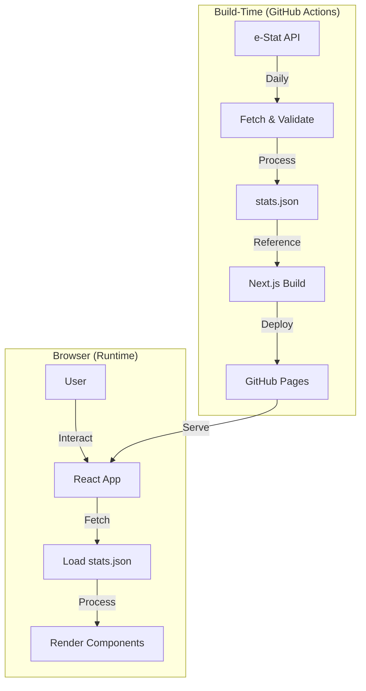

### Application Runtime Flow

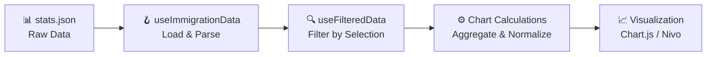

## Data Flow

### 1. Initial Page Load

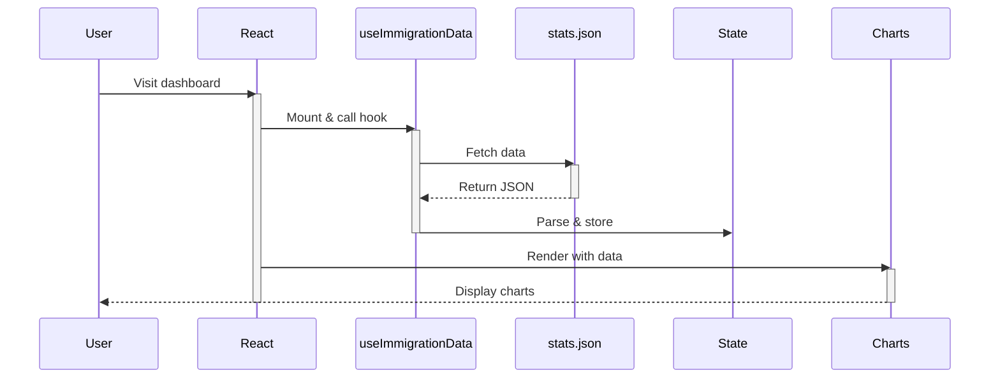

### 2. User Interaction (Filter Selection)

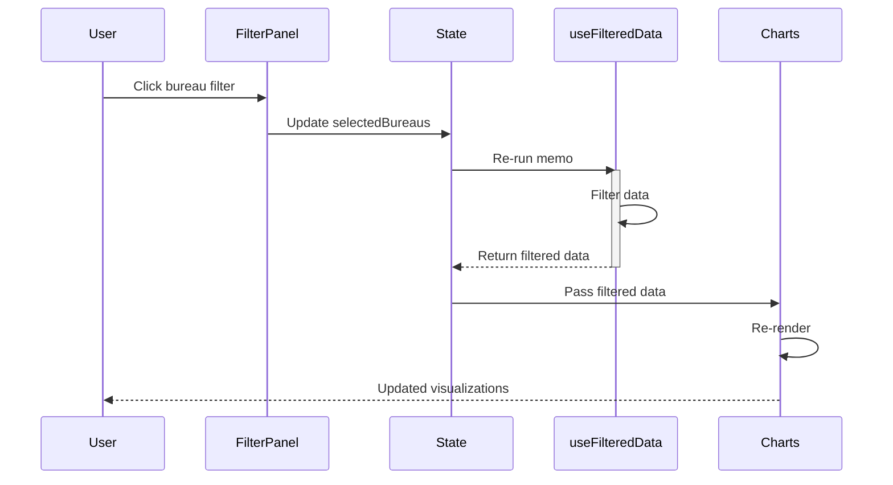

### 3. Chart Rendering

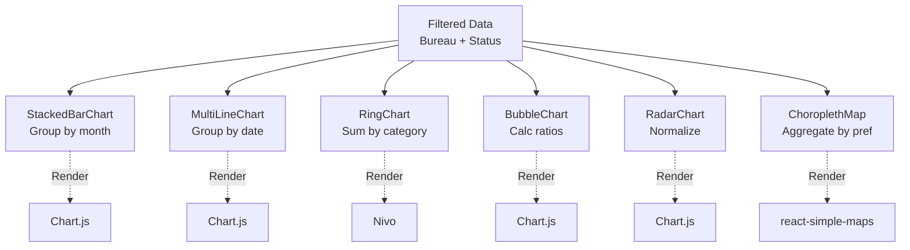

## Component Architecture

### Component Hierarchy

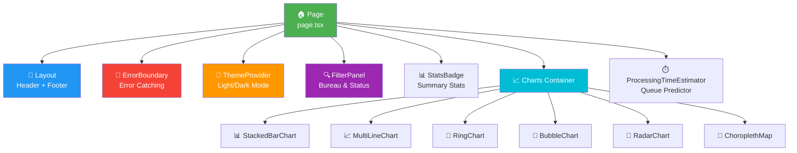

### Key Components

#### **Page Component** (`src/app/[[...slug]]/page.tsx`)

The root component that:
- Initializes the app layout
- Fetches immigration data
- Manages filter state
- Coordinates all child components
- Handles URL parameters for estimator permalinks

#### **FilterPanel** (`src/components/common/FilterPanel.tsx`)

Controls for filtering data:
- Bureau selection (multi-select)
- Application type selection (multi-select)
- Dynamically updates based on available data
- Filters are applied across all connected charts

#### **Chart Components** (`src/components/charts/`)

Six independent visualization components:

| Component | Library | Purpose |
|-----------|---------|---------|
| StackedBarChart | Chart.js | Intake/Processing trends |
| MultiLineChart | Chart.js | Submission trends over time |
| RingChart | Nivo | Application type distribution |
| BubbleChart | Chart.js | Intake vs. Processing efficiency |
| RadarChart | Chart.js | Category spread by bureau |
| ChoroplethMap | react-simple-maps | Geographic distribution |

Each chart:
- Receives pre-filtered data as props
- Manages its own visualization state
- Is self-contained and reusable

#### **ProcessingTimeEstimator** (`src/components/common/ProcessingTimeEstimator.tsx`)

Interactive queue position estimator:
- Accepts user input (bureau, application type, submission date)
- Calls estimation functions
- Displays detailed calculations with KaTeX formulas
- Generates shareable permalinks

#### **StatsBadge** (`src/components/common/StatsBadge.tsx`)

Summary statistics display:
- Shows key metrics (last updated, bureau data points)
- Updates based on filters
- Responsive layout for mobile

### Layout Components

#### **Header** (`src/components/layouts/Header.tsx`)
- Navigation and branding
- Version display (clickable for changelog)
- Dark/light mode toggle

#### **Footer** (`src/components/layouts/Footer.tsx`)
- Attribution and links
- Data source credit (e-Stat)

#### **ErrorBoundary** (`src/components/common/ErrorBoundary.tsx`)
- Catches React errors
- Displays user-friendly error message
- Prevents blank page on crash

## State Management

### State Architecture

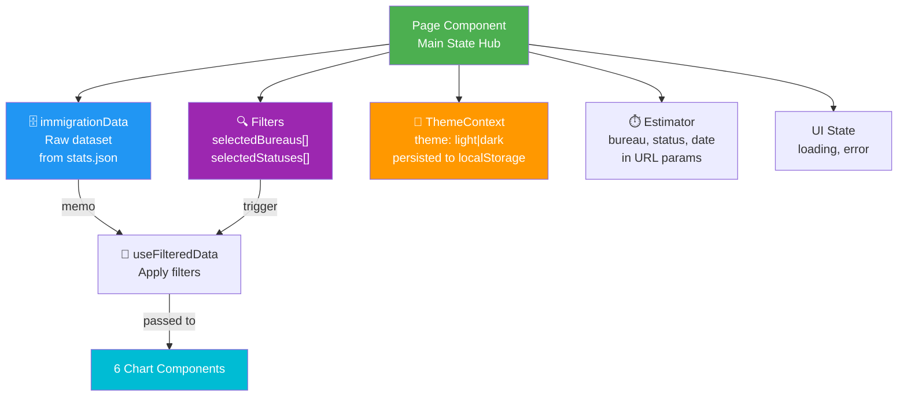

### Why No Redux/Zustand?

**Design Decision:** React's built-in state + hooks is sufficient because:

1. **Simple Data Flow** — Unidirectional: Data → Filter → Calculate → Render
2. **Localized Updates** — Most state changes are isolated to a few components
3. **Performance** — Memoization (`useMemo`, `useCallback`) is sufficient
4. **Reduced Complexity** — Smaller learning curve for contributors
5. **Bundle Size** — No additional dependency overhead

### No Redux or Complex State Management

**Design Decision:** The app uses React's built-in state and hooks because:
1. Data flow is unidirectional (top-down)
2. Most state is derived from filters + raw data
3. Performance is sufficient without memoization middleware
4. Simpler codebase to maintain and understand

## Data Processing Pipeline

### 1. Raw Data Structure

```json
{
  "data": [
    {
      "date": "2026-07-01",
      "bureau": "Tokyo",
      "status": "PROCESSING",
      "count": 1234,
      "category": "Work Visa",
      "averageProcessingDays": 45
    }
  ]
}
```

### 2. Data Processing Pipeline

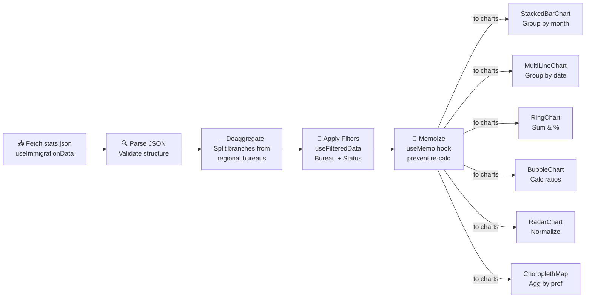

### 3. Data Deaggregation

Some bureaus (Tokyo, Osaka, Nagoya, Fukuoka) are **aggregates** that include branch office data from e-Stat:

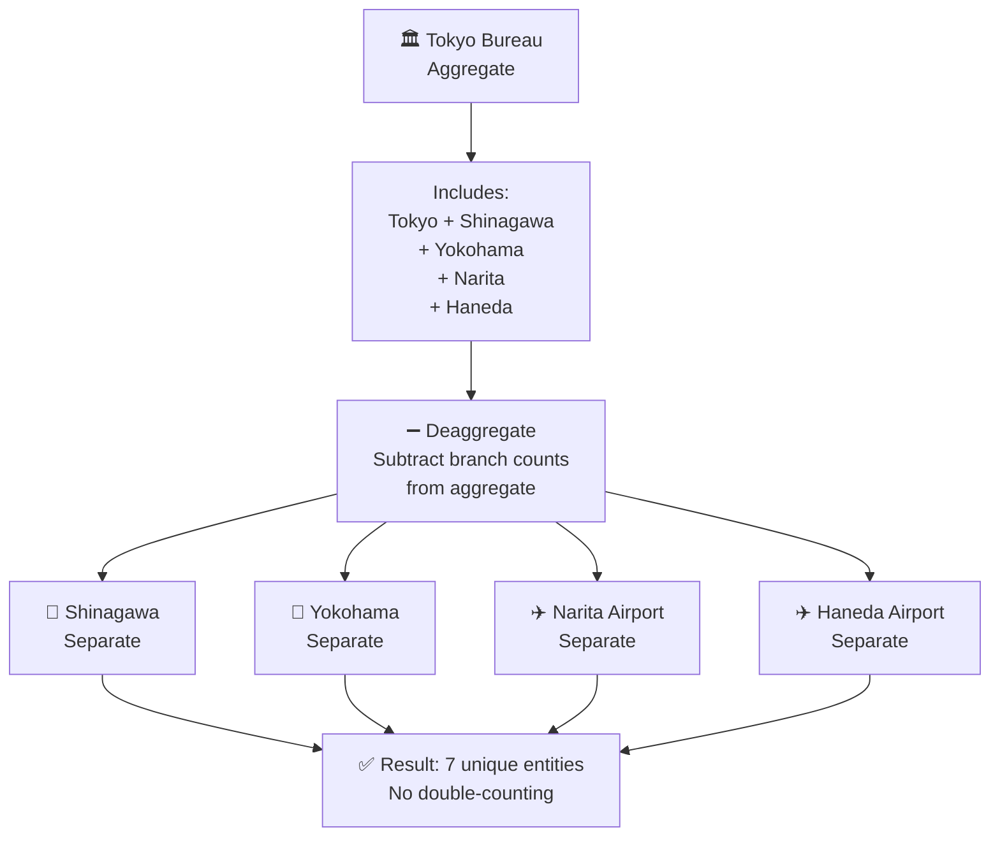

**Code Location:** `src/utils/data-processing.ts` → `deaggregateData()`

### 4. Filtering & Memoization

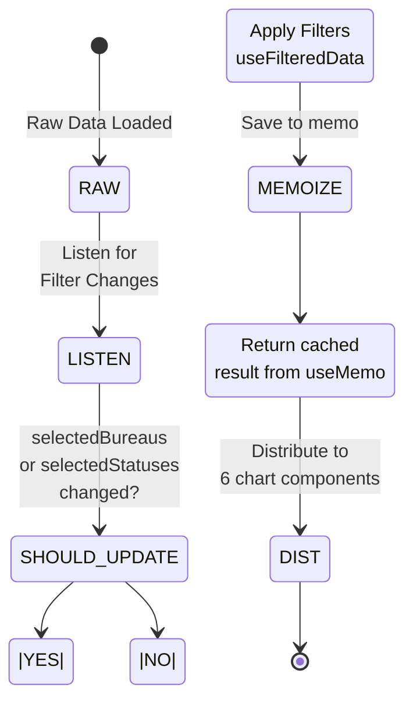

### 5. Estimation Model

For processing time prediction:

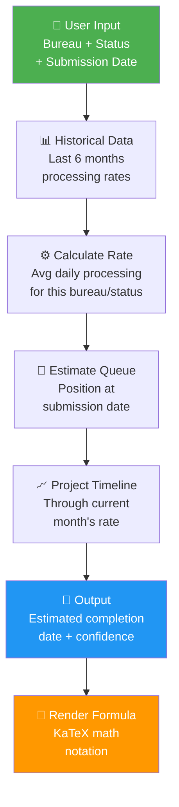

**Code Location:** `src/utils/estimation.ts`

## Performance Optimizations

### Optimization Strategies

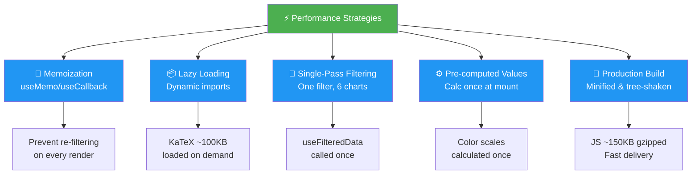

### Memoization Example

```typescript
// Prevent unnecessary re-calculations
const filteredData = useMemo(() => {
  return rawData.filter(...);
}, [rawData, selectedFilters]);

// Prevent unnecessary re-renders of child components
const memoizedCallback = useCallback(() => {
  handleFilter(value);
}, [value]);
```

### Lazy Loading Example

```typescript
// KaTeX is ~100KB, loaded dynamically
const KaTeX = dynamic(() => import('react-katex'));
```

### Single-Pass Filtering

All charts use the same filtered dataset:
- One call to `useFilteredData`
- Avoid filtering 6 different times
- Distribute to 6 chart components via props

### Pre-Computed Values

```typescript
// Calculated at component mount, not on every render
const prefectureColors = usePrefectureColors(data);
```

## Type Safety

### Type Safety Strategy

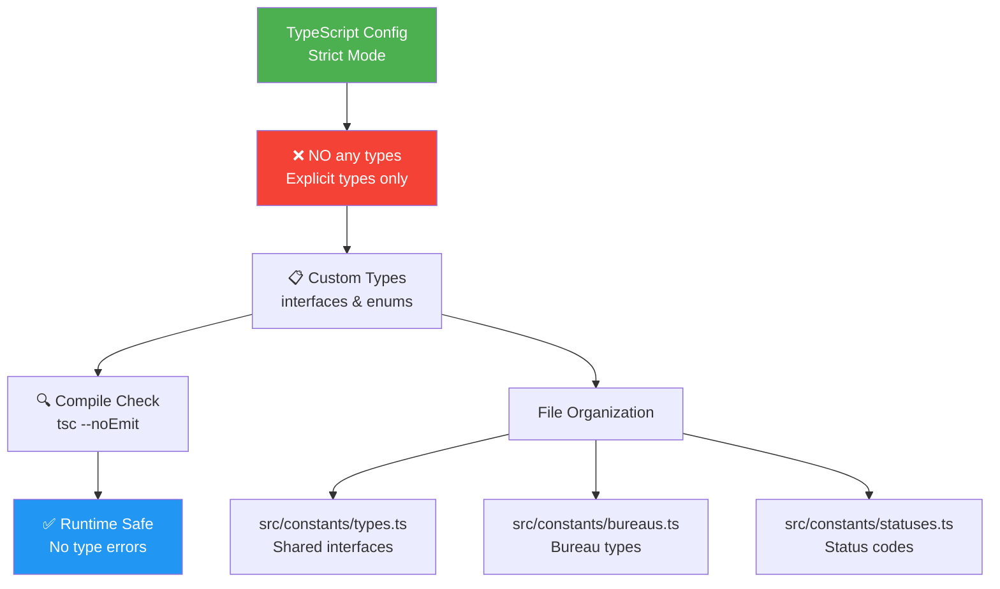

### Strict TypeScript Configuration

```json
// tsconfig.json
{
  "compilerOptions": {
    "strict": true,
    "noImplicitAny": true,
    "strictNullChecks": true,
    "strictFunctionTypes": true
  }
}
```

### Zero `any` Policy Example

```typescript
// Define explicit types
interface ImmigrationData {
  date: string
  bureau: string
  status: StatusCode
  count: number
  category: string
  averageProcessingDays: number
}

// Use in functions with type annotations
function processData(data: ImmigrationData[]): ProcessedData[] {
  // Compiler error if data structure doesn't match
  return data.map(item => ({
    // ...
  }));
}
```

## Design Patterns

### Patterns Used in the Project

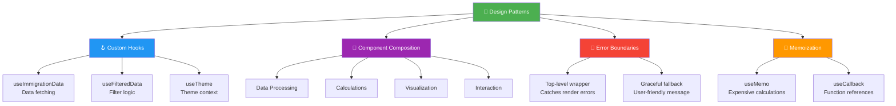

### Custom Hooks

**useImmigrationData** — Fetches and parses data
```typescript
const data = useImmigrationData();
```

**useFilteredData** — Applies filtering logic
```typescript
const filtered = useFilteredData(data, selectedBureaus, selectedStatuses);
```

**useTheme** — Theme management via Context
```typescript
const { theme, toggleTheme } = useTheme();
```

### Component Composition

Charts follow a consistent pattern:

```
Raw Data
    ↓
[Filter] — Apply bureau/status filters
    ↓
[Calculate] — Chart-specific aggregations
    ↓
[Normalize] — Scale and format for visualization
    ↓
[Render] — Use Chart.js/Nivo/react-simple-maps
    ↓
[Interact] — Handle tooltips and events
```

### Error Boundaries

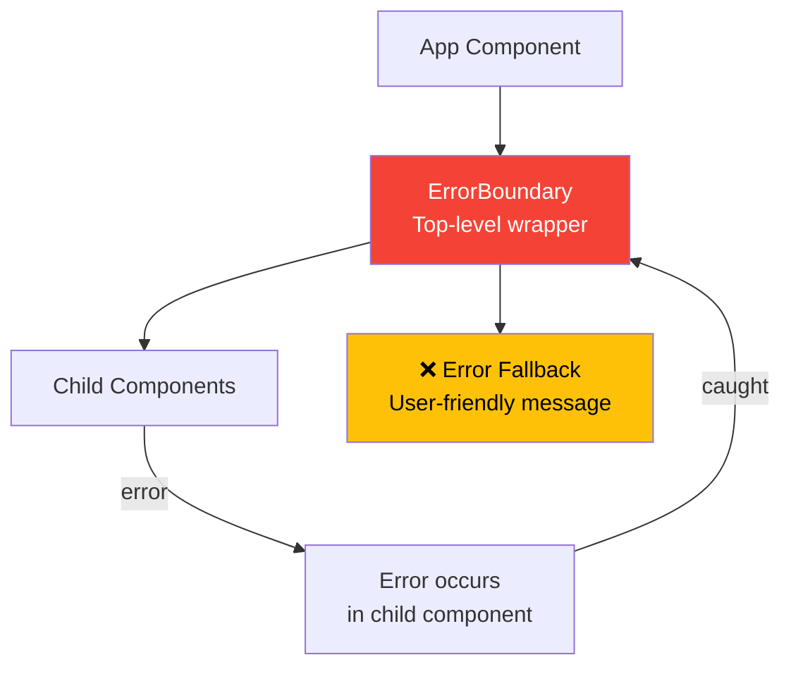

## File Organization Philosophy

### Principle: Colocate Related Code

```
components/
├── charts/
│   ├── StackedBarChart.tsx        # Component + styling
│   ├── StackedBarChart.test.tsx    # Tests for this chart
│   └── hooks/
│       └── useChartData.ts         # Chart-specific hook
```

### Principle: Shared Code in Utils/Hooks

Code used by multiple components goes to:
- `src/hooks/` — Shared React hooks
- `src/utils/` — Pure utility functions
- `src/constants/` — Constants and types

### Principle: Minimal Abstraction

No unnecessary abstractions. A function isn't extracted until it's:
1. Shared by multiple components
2. Complex enough to warrant testing
3. Likely to change independently

## Key Architectural Decisions

### Decision Matrix

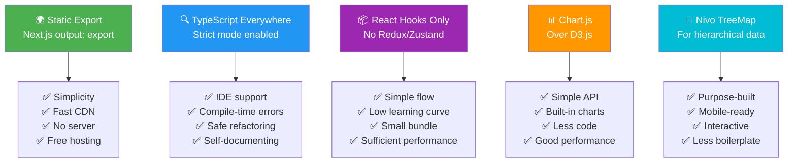

### Why Static Export?

- **Simplicity** — No backend server needed
- **Performance** — Fast CDN delivery via GitHub Pages
- **Reliability** — No server downtime risk
- **Cost** — Free hosting on GitHub Pages

### Why TypeScript Everywhere?

- **Developer Experience** — IDE auto-complete and type hints
- **Bug Prevention** — Catch errors at compile-time
- **Refactoring Safety** — Type changes caught globally
- **Documentation** — Types serve as inline documentation

### Why No State Management Library?

- **Unnecessary Complexity** — Simple unidirectional data flow
- **Learning Curve** — Easier for new contributors
- **Bundle Size** — No Redux/Zustand overhead
- **Performance** — React's built-in state is sufficient

### Why Chart.js over D3?

- **Simpler API** — Easier to implement and maintain
- **Good for Common Charts** — Stacked bars, lines, radar, bubble
- **Less Code** — D3 requires more boilerplate
- **Performance** — Efficient rendering for our use case

### Why Nivo for TreeMap?

- **Specialized** — Purpose-built for hierarchical data
- **Responsive** — Handles mobile automatically
- **Interactive** — Built-in tooltips and interactions
- **Less Code** — Compared to building from scratch

## Testing Strategy

### Unit Tests for Logic

```typescript
// Test pure functions
test('calculateAverageProcessingRate calculates correctly', () => {
  const data = [/* ... */];
  const result = calculateAverageProcessingRate(data);
  expect(result).toBe(expectedValue);
});
```

### Integration Tests for Components

```typescript
// Test component behavior
test('FilterPanel filters data when selection changes', () => {
  render(<FilterPanel {...props} />);
  userEvent.click(screen.getByLabelText('Tokyo'));
  expect(onFilterChange).toHaveBeenCalled();
});
```

### No E2E Tests Currently

**Reason:** Difficult to test in CI without real data, and most logic is unit-testable.

## Future Architecture Improvements

1. **Testing** — Increase test coverage for edge cases
2. **Performance** — Monitor Core Web Vitals, optimize if needed
3. **Accessibility** — More ARIA labels and keyboard navigation
4. **Documentation** — Inline code comments for complex logic
5. **Caching** — Service Worker for offline support

## Glossary

- **Bureau** — Regional Immigration Bureau (e.g., Tokyo, Osaka)
- **Status** — Application processing status (e.g., "Processing", "Approved")
- **Aggregate Bureau** — Bureau with branch offices (data includes branches)
- **Branch Office** — Sub-bureau reporting separately (e.g., Yokohama under Tokyo)
- **e-Stat** — Official Japanese statistics API
- **SURVEY_DATE** — Date of data collection in e-Stat

---

For questions about specific components or design decisions, check the code comments or open a [GitHub discussion](https://github.com/RetroHazard/JP_Immigration_Dashboard/discussions).
