# Architecture Guide

> **Note:** The 2026 "Civic Glass" redesign replaced Chart.js/react-simple-maps with vendored Bklit UI (visx) charts, moved the e-Stat transform to build time, introduced URL-first state via nuqs, and consolidated UI primitives on shadcn/ui. Sections below are updated where they materially changed; diagrams reflect the current stack.

Overview of the Japan Immigration Statistics Dashboard's architecture, design patterns, and key components.

## Table of Contents

- [High-Level Overview](#high-level-overview)
- [Data Flow](#data-flow)
- [Component Architecture](#component-architecture)
- [State Management](#state-management)
- [Data Processing Pipeline](#data-processing-pipeline)
- [Performance Optimizations](#performance-optimizations)
- [Type Safety](#type-safety)
- [Design Patterns](#design-patterns)
- [File Organization Philosophy](#file-organization-philosophy)

## High-Level Overview

The dashboard is a **static single-page application (SPA)** built with Next.js that runs entirely in the browser. It processes and visualizes immigration statistics from the Japanese e-Stat API.

### Application Architecture

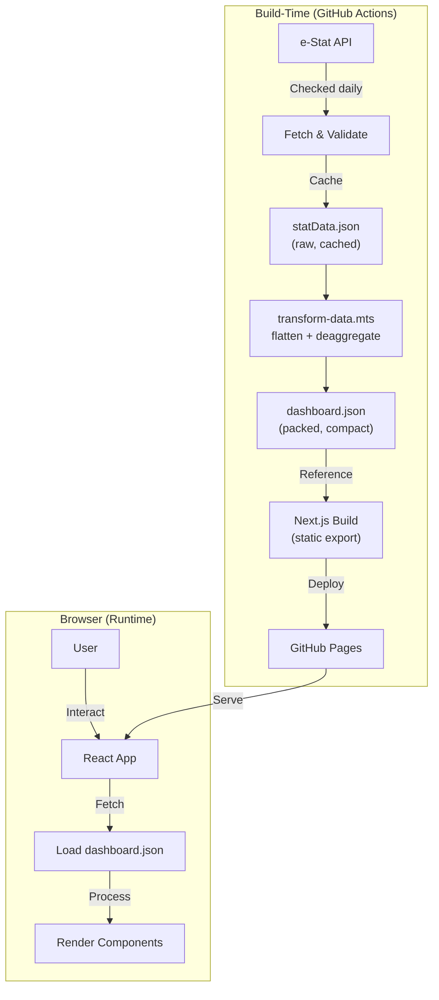
```mermaid
graph TB
    subgraph "Build-Time (GitHub Actions)"
        ESTAT["e-Stat API"]
        FETCH["Fetch & Validate"]
        RAW["statData.json<br/>(raw, cached)"]
        TRANSFORM["transform-data.mts<br/>flatten + deaggregate"]
        STATS["dashboard.json<br/>(packed, compact)"]
        BUILD["Next.js Build<br/>(static export)"]
        DEPLOY["GitHub Pages"]
        
        ESTAT -->|Checked daily| FETCH
        FETCH -->|Cache| RAW
        RAW --> TRANSFORM
        TRANSFORM --> STATS
        STATS -->|Reference| BUILD
        BUILD -->|Deploy| DEPLOY
    end
    
    subgraph "Browser (Runtime)"
        USER["User"]
        APP["React App"]
        LOAD["Load dashboard.json"]
        RENDER["Render Components"]
        
        USER -->|Interact| APP
        APP -->|Fetch| LOAD
        LOAD -->|Process| RENDER
    end
    
    DEPLOY -->|Serve| APP
```

### Application Runtime Flow

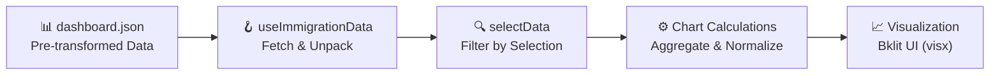
```mermaid
graph LR
    DATA["📊 dashboard.json<br/>Pre-transformed Data"] 
    HOOK["🪝 useImmigrationData<br/>Fetch & Unpack"]
    FILTER["🔍 selectData<br/>Filter by Selection"]
    CALC["⚙️ Chart Calculations<br/>Aggregate & Normalize"]
    VIZ["📈 Visualization<br/>Bklit UI (visx)"]
    
    DATA --> HOOK
    HOOK --> FILTER
    FILTER --> CALC
    CALC --> VIZ
```

## Data Flow

### 1. Initial Page Load

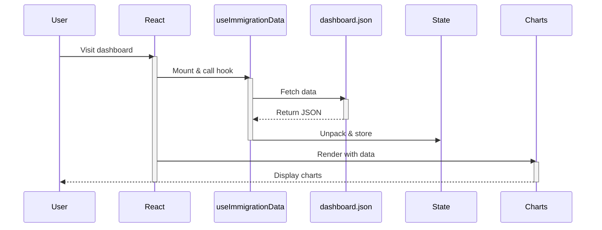
```mermaid
sequenceDiagram
    participant User
    participant React
    participant Hook as useImmigrationData
    participant JSON as dashboard.json
    participant State
    participant Charts
    
    User->>React: Visit dashboard
    activate React
    React->>Hook: Mount & call hook
    activate Hook
    Hook->>JSON: Fetch data
    activate JSON
    JSON-->>Hook: Return JSON
    deactivate JSON
    Hook->>State: Unpack & store
    deactivate Hook
    React->>Charts: Render with data
    activate Charts
    Charts-->>User: Display charts
    deactivate Charts
    deactivate React
```

### 2. User Interaction (Filter Selection)

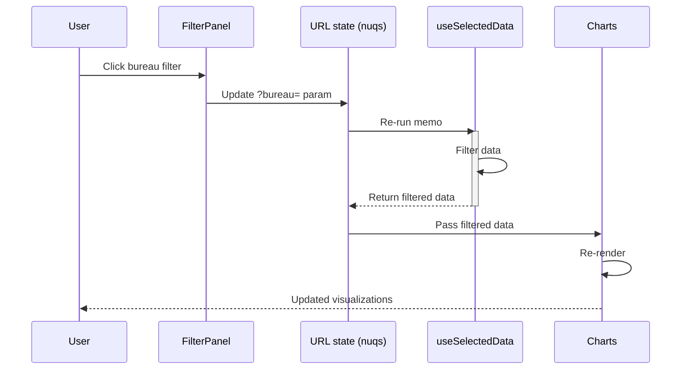
```mermaid
sequenceDiagram
    participant User
    participant FilterPanel
    participant State as URL state (nuqs)
    participant selectData as useSelectedData
    participant Charts
    
    User->>FilterPanel: Click bureau filter
    FilterPanel->>State: Update ?bureau= param
    State->>selectData: Re-run memo
    activate selectData
    selectData->>selectData: Filter data
    selectData-->>State: Return filtered data
    deactivate selectData
    State->>Charts: Pass filtered data
    Charts->>Charts: Re-render
    Charts-->>User: Updated visualizations
```

### 3. Chart Rendering

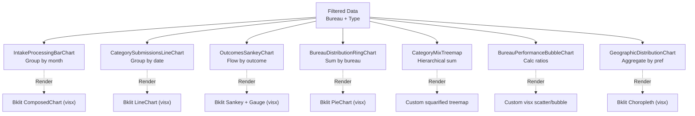
```mermaid
graph TD
    FILTERED["Filtered Data<br/>Bureau + Type"]
    INTAKE["IntakeProcessingBarChart<br/>Group by month"]
    TYPES["CategorySubmissionsLineChart<br/>Group by date"]
    OUTCOMES["OutcomesSankeyChart<br/>Flow by outcome"]
    SHARE["BureauDistributionRingChart<br/>Sum by bureau"]
    MIX["CategoryMixTreemap<br/>Hierarchical sum"]
    EFFICIENCY["BureauPerformanceBubbleChart<br/>Calc ratios"]
    MAP["GeographicDistributionChart<br/>Aggregate by pref"]
    
    FILTERED --> INTAKE
    FILTERED --> TYPES
    FILTERED --> OUTCOMES
    FILTERED --> SHARE
    FILTERED --> MIX
    FILTERED --> EFFICIENCY
    FILTERED --> MAP
    
    INTAKE -.->|Render| VIZ1["Bklit ComposedChart (visx)"]
    TYPES -.->|Render| VIZ2["Bklit LineChart (visx)"]
    OUTCOMES -.->|Render| VIZ3["Bklit Sankey + Gauge (visx)"]
    SHARE -.->|Render| VIZ4["Bklit PieChart (visx)"]
    MIX -.->|Render| VIZ5["Custom squarified treemap"]
    EFFICIENCY -.->|Render| VIZ6["Custom visx scatter/bubble"]
    MAP -.->|Render| VIZ7["Bklit Choropleth (visx)"]
```

A sibling `CategoryMixSunburst.tsx` renders the same hierarchy (shared `categoryMixTree.ts`) as a sunburst instead of a treemap; it isn't currently wired into the chart tab registry.

## Component Architecture

### Component Hierarchy

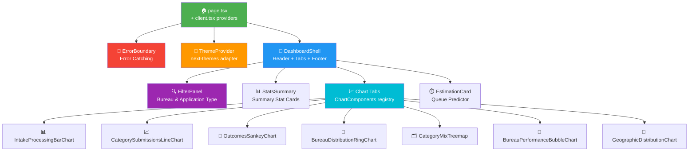
```mermaid
graph TD
    APP["🏠 page.tsx<br/>+ client.tsx providers"]
    
    APP --> ERROR["🚨 ErrorBoundary<br/>Error Catching"]
    APP --> THEME["🎨 ThemeProvider<br/>next-themes adapter"]
    APP --> SHELL["📐 DashboardShell<br/>Header + Tabs + Footer"]
    
    SHELL --> FILTER["🔍 FilterPanel<br/>Bureau & Application Type"]
    SHELL --> STATS["📊 StatsSummary<br/>Summary Stat Cards"]
    SHELL --> CHARTS["📈 Chart Tabs<br/>ChartComponents registry"]
    SHELL --> ESTIMATOR["⏱️ EstimationCard<br/>Queue Predictor"]
    
    CHARTS --> INTAKE["📊 IntakeProcessingBarChart"]
    CHARTS --> TYPES["📈 CategorySubmissionsLineChart"]
    CHARTS --> OUTCOMES["🔀 OutcomesSankeyChart"]
    CHARTS --> SHARE["🍩 BureauDistributionRingChart"]
    CHARTS --> MIX["🗂️ CategoryMixTreemap"]
    CHARTS --> EFFICIENCY["🫧 BureauPerformanceBubbleChart"]
    CHARTS --> MAP["🗾 GeographicDistributionChart"]
    
    style APP fill:#4CAF50,color:#fff
    style SHELL fill:#2196F3,color:#fff
    style ERROR fill:#F44336,color:#fff
    style THEME fill:#FF9800,color:#fff
    style FILTER fill:#9C27B0,color:#fff
    style CHARTS fill:#00BCD4,color:#fff
```

### Key Components

#### **Page / Client Wrapper** (`src/app/[[...slug]]/page.tsx`, `client.tsx`)

`page.tsx` is a thin static-params wrapper; `client.tsx` sets up the client providers (nuqs URL adapter, ThemeProvider, LocaleProvider, TooltipProvider, ErrorBoundary) and dynamically imports `App.tsx` (`ssr: false`). `App.tsx` calls `useImmigrationData` and renders `DashboardShell` once data is loaded.

#### **DashboardShell** (`src/components/DashboardShell.tsx`)

The single responsive shell that:
- Renders the header, chart tabs, filter bar, data table, and footer
- Owns the URL-first state (`chart`, `bureau`, `type`, `range`, `compare` query params via nuqs)
- Hosts the Processing Time Estimator as a collapsible desktop sidebar or a mobile bottom sheet
- Coordinates all child components

#### **FilterPanel** (`src/components/FilterPanel.tsx`)

Controls for filtering data:
- Bureau selection (single-select, plus an optional "Compare With" second bureau)
- Application type selection
- Filter availability is driven per-chart by the `ChartComponents` registry
- Filters are applied to whichever chart is active

#### **Chart Components** (`src/components/charts/`)

Seven chart components, registered in `src/components/common/ChartComponents.tsx` and rendered as tabs:

| Component | Library | Purpose |
|-----------|---------|---------|
| IntakeProcessingBarChart | Bklit ComposedChart | Intake/Processing trends |
| CategorySubmissionsLineChart | Bklit LineChart | Submission trends over time |
| OutcomesSankeyChart | Bklit Sankey + Gauge | Application outcomes flow + approval rate |
| BureauDistributionRingChart | Bklit PieChart | Bureau share of intake |
| CategoryMixTreemap | Custom squarified treemap | Applications by type and bureau |
| BureauPerformanceBubbleChart | Custom visx SVG | Intake vs. Processing efficiency |
| GeographicDistributionChart | Bklit Choropleth (visx) | Geographic distribution |

An eighth component, `CategoryMixSunburst.tsx`, renders the same Category Mix hierarchy as a sunburst but isn't currently wired into the registry.

Each chart:
- Receives pre-filtered data as props
- Manages its own visualization state
- Is self-contained and reusable

#### **EstimationCard** (`src/components/EstimationCard.tsx`)

Interactive queue position estimator:
- Accepts user input (bureau, application type, submission date)
- Calls `calculateEstimatedDate` (`src/utils/calculateEstimates.ts`)
- Displays a "Show the math" breakdown with KaTeX formulas (`FormulaTooltip`)
- Generates shareable permalinks (`src/utils/urlApplicationDetails.ts`)

#### **StatsSummary** (`src/components/StatsSummary.tsx`)

Summary statistics display, built from `StatCard` (`src/components/common/StatCard.tsx`):
- Shows key metrics (submissions, processed, approval rate, etc.), animated with `@number-flow/react`
- Updates based on filters
- Responsive layout for mobile

### Header & Footer

There is no separate `layouts/` directory — the header (branding, language toggle, theme toggle, changelog trigger) and footer (attribution, e-Stat credit) markup live directly inside `DashboardShell.tsx`.

#### **ErrorBoundary** (`src/components/common/ErrorBoundary.tsx`)
- Catches React errors
- Displays user-friendly error message
- Prevents blank page on crash

## State Management

### State Architecture

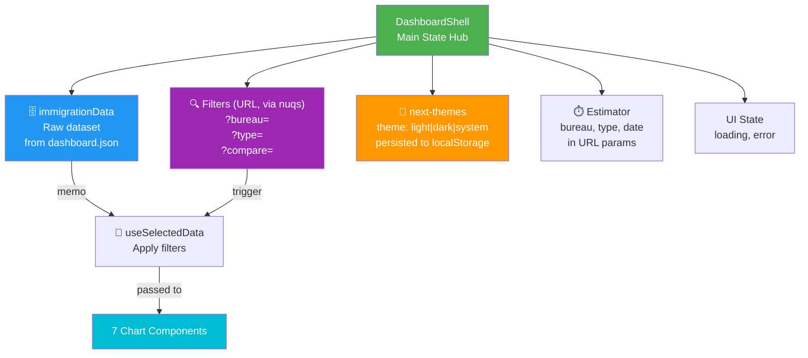
```mermaid
graph TD
    SHELL["DashboardShell<br/>Main State Hub"]
    
    DATA["🗄️ immigrationData<br/>Raw dataset<br/>from dashboard.json"]
    
    FILTERS["🔍 Filters (URL, via nuqs)<br/>?bureau=<br/>?type=<br/>?compare="]
    
    THEME["🎨 next-themes<br/>theme: light|dark|system<br/>persisted to localStorage"]
    
    ESTIMATOR["⏱️ Estimator<br/>bureau, type, date<br/>in URL params"]
    
    UI["UI State<br/>loading, error"]
    
    SHELL --> DATA
    SHELL --> FILTERS
    SHELL --> THEME
    SHELL --> ESTIMATOR
    SHELL --> UI
    
    DATA -->|memo| FILTERED["🔄 useSelectedData<br/>Apply filters"]
    FILTERS -->|trigger| FILTERED
    FILTERED -->|passed to| CHARTS["7 Chart Components"]
    
    style SHELL fill:#4CAF50,color:#fff
    style DATA fill:#2196F3,color:#fff
    style FILTERS fill:#9C27B0,color:#fff
    style THEME fill:#FF9800,color:#fff
    style CHARTS fill:#00BCD4,color:#fff
```

### Why No Redux/Zustand?

**Design Decision:** React's built-in state + hooks is sufficient because:

1. **Simple Data Flow** — Unidirectional: Data → Filter → Calculate → Render
2. **Localized Updates** — Most state changes are isolated to a few components
3. **Performance** — Memoization (`useMemo`, `useCallback`) is sufficient
4. **Reduced Complexity** — Smaller learning curve for contributors
5. **Bundle Size** — No additional dependency overhead

### No Redux or Complex State Management

**Design Decision:** The app uses React's built-in state and hooks because:
1. Data flow is unidirectional (top-down)
2. Most state is derived from filters + raw data
3. Performance is sufficient without memoization middleware
4. Simpler codebase to maintain and understand

## Data Processing Pipeline

### 1. Client-Side Data Shape

The `ImmigrationData` record the client loads and filters (`src/hooks/useImmigrationData.ts`):

```typescript
interface ImmigrationData {
  month: string;    // "2026-07"
  bureau: string;    // e-Stat bureau code
  type: string;       // application type code
  value: number;
  status: string;     // e-Stat status code
}
```

`public/data/dashboard.json` stores this as a packed schema (index tables + flat value tuples, ~10x smaller than the raw payload) that `unpackDashboardData` (`src/utils/dashboardData.ts`) expands back into `ImmigrationData[]`.

### 2. Build-Time vs. Runtime Pipeline

Bureau-aggregate correction (deaggregation) now happens **once at build time**, not on every page load:

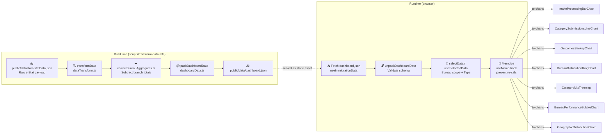
```mermaid
graph LR
    subgraph "Build time (scripts/transform-data.mts)"
        RAW["📥 public/datastore/statData.json<br/>Raw e-Stat payload"]
        FLATTEN["🔍 transformData<br/>dataTransform.ts"]
        CORRECT["➖ correctBureauAggregates.ts<br/>Subtract branch totals"]
        PACK["📦 packDashboardData<br/>dashboardData.ts"]
        OUT["📤 public/data/dashboard.json"]
        
        RAW --> FLATTEN
        FLATTEN --> CORRECT
        CORRECT --> PACK
        PACK --> OUT
    end
    
    subgraph "Runtime (browser)"
        FETCH["📥 Fetch dashboard.json<br/>useImmigrationData"]
        UNPACK["🔓 unpackDashboardData<br/>Validate schema"]
        FILTER["🔑 selectData / useSelectedData<br/>Bureau scope + Type"]
        CACHE["💾 Memoize<br/>useMemo hook<br/>prevent re-calc"]
        
        FETCH --> UNPACK
        UNPACK --> FILTER
        FILTER --> CACHE
    end
    
    OUT -.->|served as static asset| FETCH
    
    CACHE -->|to charts| INTAKE["IntakeProcessingBarChart"]
    CACHE -->|to charts| TYPES["CategorySubmissionsLineChart"]
    CACHE -->|to charts| OUTCOMES["OutcomesSankeyChart"]
    CACHE -->|to charts| SHARE["BureauDistributionRingChart"]
    CACHE -->|to charts| MIX["CategoryMixTreemap"]
    CACHE -->|to charts| EFFICIENCY["BureauPerformanceBubbleChart"]
    CACHE -->|to charts| MAP["GeographicDistributionChart"]
```

### 3. Data Deaggregation

Some bureaus (Tokyo, Osaka, Nagoya, Fukuoka) are **aggregates** that include branch office data from e-Stat. This correction now runs once at build time (see the pipeline above), not per page load:

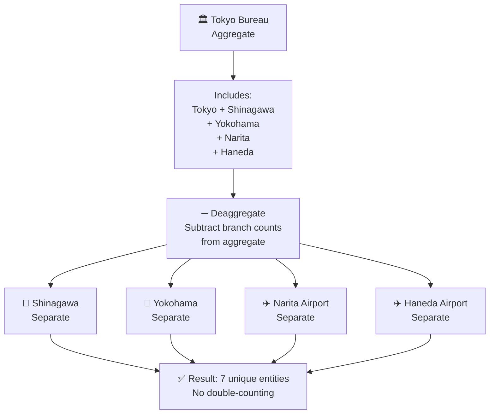
```mermaid
graph TD
    TOKYO["🏛️ Tokyo Bureau<br/>Aggregate"]
    TOKYO_RAW["Includes:<br/>Tokyo + Shinagawa<br/>+ Yokohama<br/>+ Narita<br/>+ Haneda"]
    
    SHINAGAWA["🏢 Shinagawa<br/>Separate"]
    YOKOHAMA["🏢 Yokohama<br/>Separate"]
    NARITA["✈️ Narita Airport<br/>Separate"]
    HANEDA["✈️ Haneda Airport<br/>Separate"]
    
    DEAGG["➖ Deaggregate<br/>Subtract branch counts<br/>from aggregate"]
    
    TOKYO --> TOKYO_RAW
    TOKYO_RAW --> DEAGG
    DEAGG --> SHINAGAWA
    DEAGG --> YOKOHAMA
    DEAGG --> NARITA
    DEAGG --> HANEDA
    
    RESULT["✅ Result: 7 unique entities<br/>No double-counting"]
    SHINAGAWA --> RESULT
    YOKOHAMA --> RESULT
    NARITA --> RESULT
    HANEDA --> RESULT
```

**Code Location:** `src/utils/correctBureauAggregates.ts` → `makeCorrectedAccessor()`, called from `src/utils/dataTransform.ts` → `transformData()` during `scripts/transform-data.mts` (build time). If a branch office hasn't published data for a period yet, that aggregate-bureau entry is skipped rather than emitted with an inflated value (see `isBranchDataIncomplete`).

### 4. Filtering & Memoization

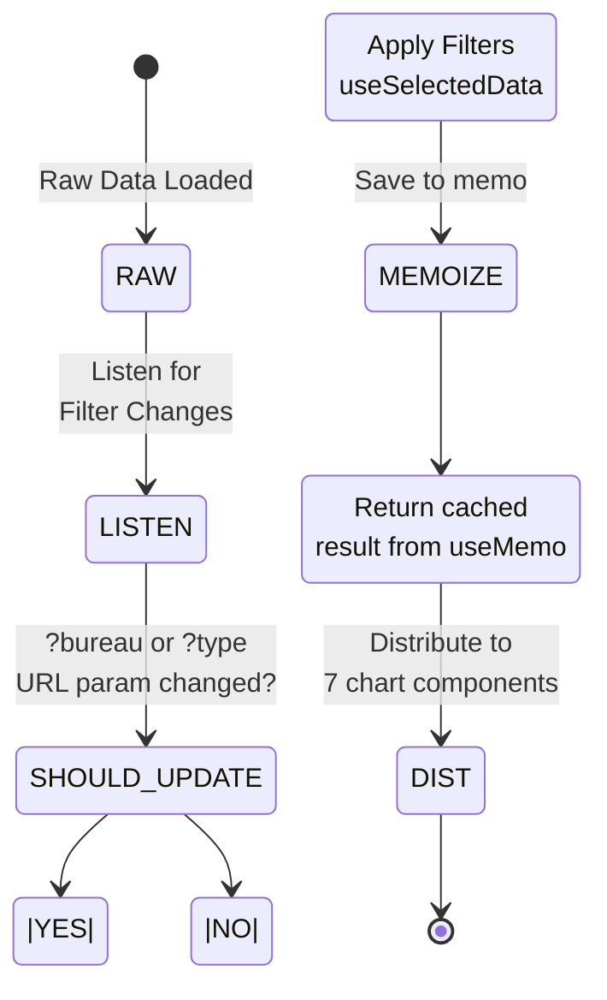
```mermaid
stateDiagram-v2
    [*] --> RAW: Raw Data Loaded

    RAW --> LISTEN: Listen for<br/>Filter Changes

    LISTEN --> SHOULD_UPDATE: ?bureau or ?type<br/>URL param changed?

    SHOULD_UPDATE --> |YES| FILTER: Apply Filters<br/>useSelectedData
    SHOULD_UPDATE --> |NO| CACHE: Return cached<br/>result from useMemo

    FILTER --> MEMOIZE: Save to memo
    MEMOIZE --> CACHE

    CACHE --> DIST: Distribute to<br/>7 chart components
    DIST --> [*]
```

### 5. Estimation Model

For processing time prediction:

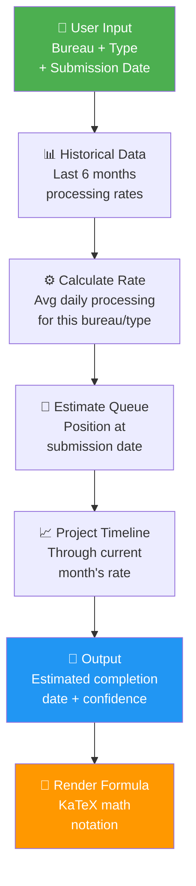
```mermaid
graph TD
    INPUT["📝 User Input<br/>Bureau + Type<br/>+ Submission Date"]
    
    HIST["📊 Historical Data<br/>Last 6 months<br/>processing rates"]
    
    RATE["⚙️ Calculate Rate<br/>Avg daily processing<br/>for this bureau/type"]
    
    QUEUE["🔢 Estimate Queue<br/>Position at<br/>submission date"]
    
    PROJECT["📈 Project Timeline<br/>Through current<br/>month's rate"]
    
    OUTPUT["📅 Output<br/>Estimated completion<br/>date + confidence"]
    
    LATEX["🔬 Render Formula<br/>KaTeX math<br/>notation"]
    
    INPUT --> HIST
    HIST --> RATE
    RATE --> QUEUE
    QUEUE --> PROJECT
    PROJECT --> OUTPUT
    OUTPUT --> LATEX
    
    style INPUT fill:#4CAF50,color:#fff
    style OUTPUT fill:#2196F3,color:#fff
    style LATEX fill:#FF9800,color:#fff
```

**Code Location:** `src/utils/calculateEstimates.ts` → `calculateEstimatedDate()`

## Performance Optimizations

### Optimization Strategies

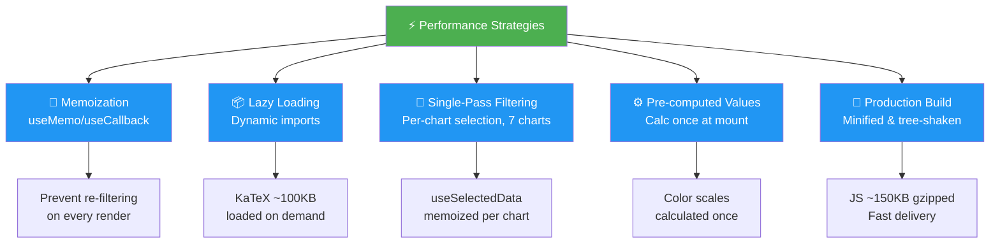
```mermaid
graph TD
    PERF["⚡ Performance Strategies"]
    
    PERF --> MEMO["📌 Memoization<br/>useMemo/useCallback"]
    PERF --> LAZY["📦 Lazy Loading<br/>Dynamic imports"]
    PERF --> SINGLE["🔄 Single-Pass Filtering<br/>Per-chart selection, 7 charts"]
    PERF --> PRECOMP["⚙️ Pre-computed Values<br/>Calc once at mount"]
    PERF --> BUILD["🔨 Production Build<br/>Minified & tree-shaken"]
    
    MEMO --> EXAMPLE1["Prevent re-filtering<br/>on every render"]
    LAZY --> EXAMPLE2["KaTeX ~100KB<br/>loaded on demand"]
    SINGLE --> EXAMPLE3["useSelectedData<br/>memoized per chart"]
    PRECOMP --> EXAMPLE4["Color scales<br/>calculated once"]
    BUILD --> EXAMPLE5["JS ~150KB gzipped<br/>Fast delivery"]
    
    style PERF fill:#4CAF50,color:#fff
    style MEMO fill:#2196F3,color:#fff
    style LAZY fill:#2196F3,color:#fff
    style SINGLE fill:#2196F3,color:#fff
    style PRECOMP fill:#2196F3,color:#fff
    style BUILD fill:#2196F3,color:#fff
```

### Memoization Example

```typescript
// Prevent unnecessary re-calculations
const filteredData = useMemo(() => {
  return rawData.filter(...);
}, [rawData, selectedFilters]);

// Prevent unnecessary re-renders of child components
const memoizedCallback = useCallback(() => {
  handleFilter(value);
}, [value]);
```

### Lazy Loading Example

```typescript
// The entire dashboard is a client-only chunk, deferred until after
// the shell's providers mount (src/app/[[...slug]]/client.tsx):
const App = dynamic(() => import('../../App'), { ssr: false });
```

### Single-Pass Filtering

Each chart calls `useSelectedData`/`selectData` (`src/utils/selectors.ts`) with the filters and range it needs:
- Filtering is memoized per chart on its own selection key
- Charts that don't use a given filter (see the `ChartComponents` registry) simply don't pass it, avoiding redundant recomputation
- Distributed to 7 chart components via props

### Pre-Computed Values

```typescript
// A bureau's flag color, clamped to stay readable per theme
// (src/utils/bureauColors.ts):
const color = visibleBureauColor(bureauOption.background, isDarkMode);
```

## Type Safety

### Type Safety Strategy

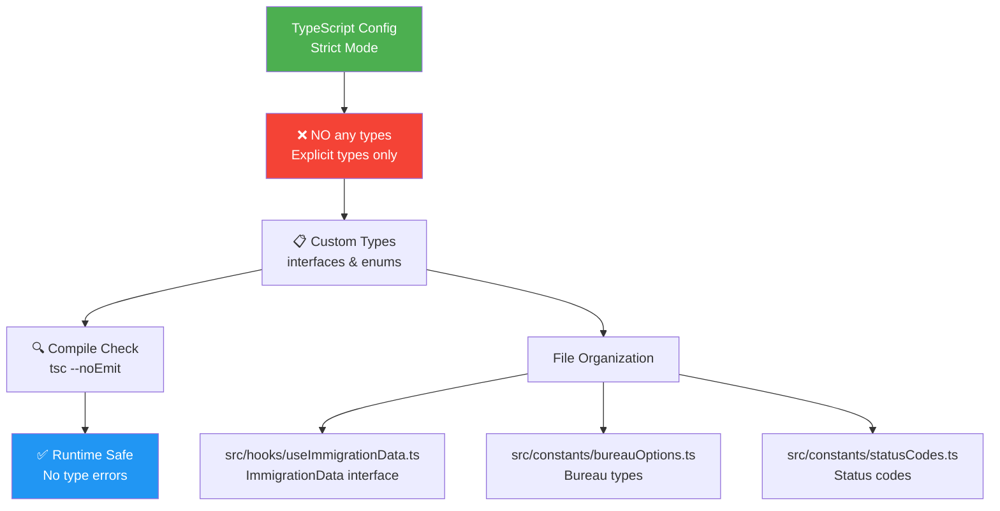
```mermaid
graph TD
    TSCONFIG["TypeScript Config<br/>Strict Mode"]
    NOANY["❌ NO any types<br/>Explicit types only"]
    TYPES["📋 Custom Types<br/>interfaces & enums"]
    COMPILE["🔍 Compile Check<br/>tsc --noEmit"]
    RUNTIME["✅ Runtime Safe<br/>No type errors"]
    
    TSCONFIG --> NOANY
    NOANY --> TYPES
    TYPES --> COMPILE
    COMPILE --> RUNTIME
    
    TYPES --> TYPEFILES["File Organization"]
    TYPEFILES --> TF1["src/hooks/useImmigrationData.ts<br/>ImmigrationData interface"]
    TYPEFILES --> TF2["src/constants/bureauOptions.ts<br/>Bureau types"]
    TYPEFILES --> TF3["src/constants/statusCodes.ts<br/>Status codes"]
    
    style TSCONFIG fill:#4CAF50,color:#fff
    style NOANY fill:#F44336,color:#fff
    style RUNTIME fill:#2196F3,color:#fff
```

### Strict TypeScript Configuration

```json
// tsconfig.json
{
  "compilerOptions": {
    "strict": true,
    "noImplicitAny": true,
    "strictNullChecks": true,
    "strictFunctionTypes": true
  }
}
```

### Zero `any` Policy Example

```typescript
// Define explicit types (src/hooks/useImmigrationData.ts)
interface ImmigrationData {
  month: string;
  bureau: string;
  type: string;
  value: number;
  status: string;
}

// Use in functions with type annotations
function processData(data: ImmigrationData[]): ProcessedData[] {
  // Compiler error if data structure doesn't match
  return data.map(item => ({
    // ...
  }));
}
```

## Design Patterns

### Patterns Used in the Project

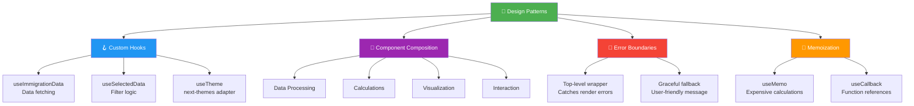
```mermaid
graph TD
    PATTERNS["🎨 Design Patterns"]
    
    PATTERNS --> HOOKS["🪝 Custom Hooks"]
    PATTERNS --> COMP["🧩 Component Composition"]
    PATTERNS --> ERROR["🚨 Error Boundaries"]
    PATTERNS --> MEMO["📌 Memoization"]
    
    HOOKS --> H1["useImmigrationData<br/>Data fetching"]
    HOOKS --> H2["useSelectedData<br/>Filter logic"]
    HOOKS --> H3["useTheme<br/>next-themes adapter"]
    
    COMP --> C1["Data Processing"]
    COMP --> C2["Calculations"]
    COMP --> C3["Visualization"]
    COMP --> C4["Interaction"]
    
    ERROR --> E1["Top-level wrapper<br/>Catches render errors"]
    ERROR --> E2["Graceful fallback<br/>User-friendly message"]
    
    MEMO --> M1["useMemo<br/>Expensive calculations"]
    MEMO --> M2["useCallback<br/>Function references"]
    
    style PATTERNS fill:#4CAF50,color:#fff
    style HOOKS fill:#2196F3,color:#fff
    style COMP fill:#9C27B0,color:#fff
    style ERROR fill:#F44336,color:#fff
    style MEMO fill:#FF9800,color:#fff
```

### Custom Hooks

**useImmigrationData** (`src/hooks/useImmigrationData.ts`) — Fetches and unpacks data
```typescript
const { data, meta, loading, error } = useImmigrationData();
```

**useSelectedData** (`src/utils/selectors.ts`) — Memoized filtering logic
```typescript
const filtered = useSelectedData(data, { scope: bureauScopeFromFilter(bureau), type });
```

**useTheme** (`src/contexts/ThemeContext.tsx`, a thin adapter over `next-themes`) — Theme management
```typescript
const { isDarkMode, toggleTheme } = useTheme();
```

### Component Composition

Charts follow a consistent pattern:

```
Raw Data
    ↓
[Filter] — Apply bureau/type filters
    ↓
[Calculate] — Chart-specific aggregations
    ↓
[Normalize] — Scale and format for visualization
    ↓
[Render] — Use Bklit UI (visx) chart components
    ↓
[Interact] — Handle tooltips and events
```

### Error Boundaries

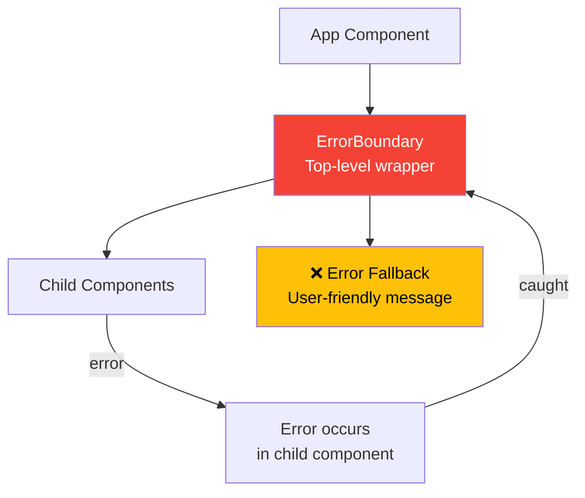
```mermaid
graph TD
    APP["App Component"]
    BOUNDARY["ErrorBoundary<br/>Top-level wrapper"]
    CHILDREN["Child Components"]
    ERROR["Error occurs<br/>in child component"]
    FALLBACK["❌ Error Fallback<br/>User-friendly message"]
    
    APP --> BOUNDARY
    BOUNDARY --> CHILDREN
    CHILDREN -->|error| ERROR
    ERROR -->|caught| BOUNDARY
    BOUNDARY --> FALLBACK
    
    style BOUNDARY fill:#F44336,color:#fff
    style FALLBACK fill:#FFC107,color:#000
```

## File Organization Philosophy

### Principle: Colocate Related Code

```
components/
├── charts/
│   ├── IntakeProcessingBarChart.tsx  # Component, styling, and its own aggregation logic
│   ├── OutcomesSankeyChart.tsx
│   └── ...
├── __tests__/
│   └── components.smoke.test.tsx     # Cross-component smoke tests
```

(Chart-specific aggregation currently lives inline in each chart component rather than in a colocated hook; utils/hooks are extracted once logic is actually shared.)

### Principle: Shared Code in Utils/Hooks

Code used by multiple components goes to:
- `src/hooks/` — Shared React hooks
- `src/utils/` — Pure utility functions
- `src/constants/` — Constants and types

### Principle: Minimal Abstraction

No unnecessary abstractions. A function isn't extracted until it's:
1. Shared by multiple components
2. Complex enough to warrant testing
3. Likely to change independently

## Key Architectural Decisions

### Decision Matrix

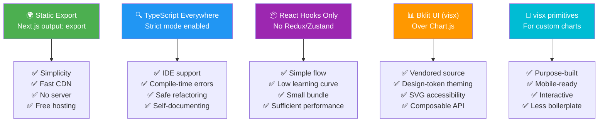
```mermaid
graph TD
    STATIC["🌍 Static Export<br/>Next.js output: export"]
    STATIC_PROS["✅ Simplicity<br/>✅ Fast CDN<br/>✅ No server<br/>✅ Free hosting"]
    
    TS["🔍 TypeScript Everywhere<br/>Strict mode enabled"]
    TS_PROS["✅ IDE support<br/>✅ Compile-time errors<br/>✅ Safe refactoring<br/>✅ Self-documenting"]
    
    STATE["📦 React Hooks Only<br/>No Redux/Zustand"]
    STATE_PROS["✅ Simple flow<br/>✅ Low learning curve<br/>✅ Small bundle<br/>✅ Sufficient performance"]
    
    CHARTS["📊 Bklit UI (visx)<br/>Over Chart.js"]
    CHARTS_PROS["✅ Vendored source<br/>✅ Design-token theming<br/>✅ SVG accessibility<br/>✅ Composable API"]
    
    NIVO["🌳 visx primitives<br/>For custom charts"]
    NIVO_PROS["✅ Purpose-built<br/>✅ Mobile-ready<br/>✅ Interactive<br/>✅ Less boilerplate"]
    
    STATIC --> STATIC_PROS
    TS --> TS_PROS
    STATE --> STATE_PROS
    CHARTS --> CHARTS_PROS
    NIVO --> NIVO_PROS
    
    style STATIC fill:#4CAF50,color:#fff
    style TS fill:#2196F3,color:#fff
    style STATE fill:#9C27B0,color:#fff
    style CHARTS fill:#FF9800,color:#fff
    style NIVO fill:#00BCD4,color:#fff
```

### Why Static Export?

- **Simplicity** — No backend server needed
- **Performance** — Fast CDN delivery via GitHub Pages
- **Reliability** — No server downtime risk
- **Cost** — Free hosting on GitHub Pages

### Why TypeScript Everywhere?

- **Developer Experience** — IDE auto-complete and type hints
- **Bug Prevention** — Catch errors at compile-time
- **Refactoring Safety** — Type changes caught globally
- **Documentation** — Types serve as inline documentation

### Why No State Management Library?

- **Unnecessary Complexity** — Simple unidirectional data flow
- **Learning Curve** — Easier for new contributors
- **Bundle Size** — No Redux/Zustand overhead
- **Performance** — React's built-in state is sufficient

### Why Bklit UI (vendored) over Chart.js?

- **Design-token theming** — Every chart reads the same CSS variables as the rest of the UI, in both themes
- **Vendored source** — Components are copied into the repo (shadcn registry model), so gaps are patched locally (e.g. responsive choropleth scale, Sankey value units)
- **SVG rendering** — Text alternatives and styling that canvas can't offer
- **Composable API** — Charts assemble from Grid/Axis/Series/Tooltip parts, so remixes stay small

## Testing Strategy

### Unit Tests for Logic

```typescript
// Test pure functions (src/utils/__tests__/calculateEstimates.test.ts)
test('calculateEstimatedDate projects a completion date', () => {
  const data = buildMonthlyData(/* ... */);
  const result = calculateEstimatedDate(data, { bureau: 'Osaka', type: 'X', applicationDate: '2025-04-01' });
  expect(result?.details.isPastDue).toBe(false);
});
```

### Integration Tests for Components

```typescript
// Test component behavior (src/components/__tests__/components.smoke.test.tsx)
test('StatCard renders title, formatted value, and MoM delta', () => {
  render(<StatCard title="Total Applications" value={12345} delta={{ percent: 3.2, direction: 'neutral' }} {...rest} />);
  expect(screen.getByText('Total Applications')).toBeTruthy();
});
```

### No E2E Tests Currently

**Reason:** Difficult to test in CI without real data, and most logic is unit-testable.

## Security & Dependency Management

### Dependency Pinning Strategy

**Some critical dependencies are pinned to exact versions:**

- **Next.js ecosystem:** `next`, `@next/third-parties`, `@next/eslint-plugin-next`, `eslint-config-next`
- **Type safety (linting):** `@typescript-eslint/eslint-plugin`, `@typescript-eslint/parser`
- **Code quality:** `eslint`

`react`, `react-dom`, and `typescript` currently use `^` caret ranges rather than exact pins.

**Benefits:**
- **Reproducibility** — Same versions across all environments (local + CI/CD)
- **Stability** — No unexpected minor/patch updates breaking functionality
- **Security** — Controlled updates for security-critical packages
- **Consistency** — Team and CI work with identical dependency versions

**Non-critical dependencies** use caret ranges (`^`) to allow patch updates automatically.

### Security Audits

There is currently no automated `npm audit` step in CI (`.github/workflows/ci.yaml` runs lint, typecheck, test, and a fixture build; `build.yaml` builds and deploys). Audits are a manual, pre-merge step:

```bash
npm audit --audit-level=moderate
```

**Response Protocol:**
1. Developer runs `npm audit` locally to identify vulnerabilities
2. Address with `npm audit fix` or manual package updates
3. Test thoroughly before merging
4. Document security fixes in commit messages and CHANGELOG

### Handling Vulnerabilities

**Transitive Dependencies:** Some vulnerabilities may be in packages that dependencies depend on:

```bash
npm audit --json | jq '.vulnerabilities'  # See all issues
npm ls vulnerable-package                  # See where it's required
npm audit fix                              # Auto-fix if available
npm install parent-package@latest          # Update parent if needed
```

**Known Vulnerabilities:** If a vulnerability exists but no fix is available yet:
1. Document in a code comment with the CVE number
2. Track in GitHub issues
3. Monitor for updates
4. Use `npm audit --force` only as a temporary measure with justification

## Future Architecture Improvements

1. **Testing** — Increase test coverage for edge cases
2. **Performance** — Monitor Core Web Vitals, optimize if needed
3. **Accessibility** — More ARIA labels and keyboard navigation
4. **Documentation** — Inline code comments for complex logic
5. **Caching** — Service Worker for offline support
6. **Dependencies** — Automated dependency update checks (Dependabot)

## Glossary

- **Bureau** — Regional Immigration Bureau (e.g., Tokyo, Osaka)
- **Status** — Application processing status (e.g., "Processing", "Approved")
- **Aggregate Bureau** — Bureau with branch offices (data includes branches)
- **Branch Office** — Sub-bureau reporting separately (e.g., Yokohama under Tokyo)
- **e-Stat** — Official Japanese statistics API
- **SURVEY_DATE** — Date of data collection in e-Stat

---

For questions about specific components or design decisions, check the code comments or open a [GitHub discussion](https://github.com/RetroHazard/JP_Immigration_Dashboard/discussions).
