# Architecture Guide

> **Note:** The 2026 "Civic Glass" redesign replaced Chart.js/react-simple-maps with vendored Bklit UI (visx) charts, moved the e-Stat transform to build time, introduced URL-first state via nuqs, and consolidated UI primitives on shadcn/ui. Sections below are updated where they materially changed; diagrams reflect the current stack.

Overview of the Japan Immigration Statistics Dashboard's architecture, design patterns, and key components.

## Table of Contents

- [High-Level Overview](#high-level-overview)
- [Data Flow](#data-flow)
- [Component Architecture](#component-architecture)
- [State Management](#state-management)
- [Data Processing Pipeline](#data-processing-pipeline)
- [Performance Optimizations](#performance-optimizations)
- [Type Safety](#type-safety)
- [Design Patterns](#design-patterns)
- [File Organization Philosophy](#file-organization-philosophy)

## High-Level Overview

The dashboard is a **static single-page application (SPA)** built with Next.js that runs entirely in the browser. It processes and visualizes immigration statistics from the Japanese e-Stat API.

### Application Architecture

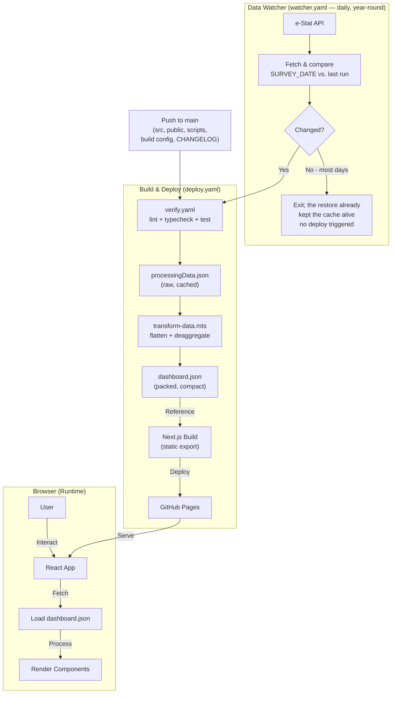
```mermaid
graph TB
    subgraph "Data Watcher (watcher.yaml — daily, year-round)"
        ESTAT["e-Stat API"]
        FETCH["Fetch & compare<br/>SURVEY_DATE vs. last run"]
        CHANGED{"Changed?"}
        
        ESTAT --> FETCH
        FETCH --> CHANGED
        CHANGED -->|No - most days| NOOP["Exit; the restore already<br/>kept the cache alive<br/>no deploy triggered"]
    end
    
    PUSH["Push to main<br/>(src, public, scripts,<br/>build config, CHANGELOG)"]
    
    subgraph "Build & Deploy (deploy.yaml)"
        VERIFY["verify.yaml<br/>lint + typecheck + test"]
        RAW["processingData.json<br/>(raw, cached)"]
        TRANSFORM["transform-data.mts<br/>flatten + deaggregate"]
        STATS["dashboard.json<br/>(packed, compact)"]
        BUILD["Next.js Build<br/>(static export)"]
        DEPLOY["GitHub Pages"]
        
        VERIFY --> RAW
        RAW --> TRANSFORM
        TRANSFORM --> STATS
        STATS -->|Reference| BUILD
        BUILD -->|Deploy| DEPLOY
    end
    
    CHANGED -->|Yes| VERIFY
    PUSH --> VERIFY
    
    subgraph "Browser (Runtime)"
        USER["User"]
        APP["React App"]
        LOAD["Load dashboard.json"]
        RENDER["Render Components"]
        
        USER -->|Interact| APP
        APP -->|Fetch| LOAD
        LOAD -->|Process| RENDER
    end
    
    DEPLOY -->|Serve| APP
```

### Application Runtime Flow

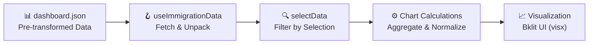
```mermaid
graph LR
    DATA["📊 dashboard.json<br/>Pre-transformed Data"] 
    HOOK["🪝 useImmigrationData<br/>Fetch & Unpack"]
    FILTER["🔍 selectData<br/>Filter by Selection"]
    CALC["⚙️ Chart Calculations<br/>Aggregate & Normalize"]
    VIZ["📈 Visualization<br/>Bklit UI (visx)"]
    
    DATA --> HOOK
    HOOK --> FILTER
    FILTER --> CALC
    CALC --> VIZ
```

## Data Flow

### 1. Initial Page Load

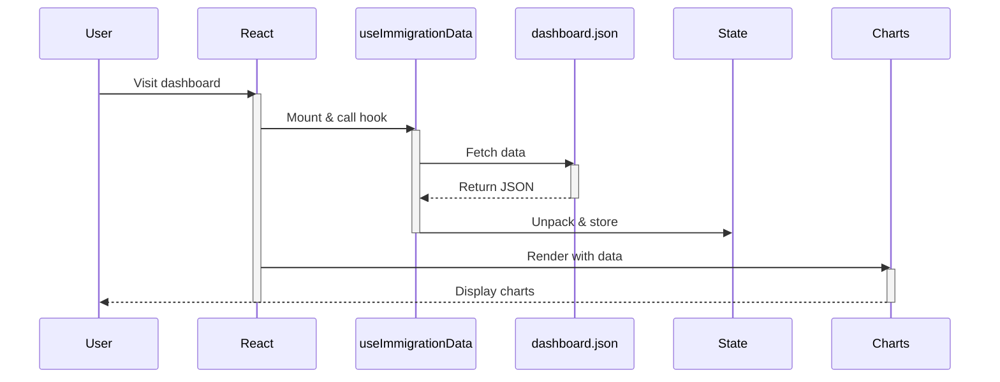
```mermaid
sequenceDiagram
    participant User
    participant React
    participant Hook as useImmigrationData
    participant JSON as dashboard.json
    participant State
    participant Charts
    
    User->>React: Visit dashboard
    activate React
    React->>Hook: Mount & call hook
    activate Hook
    Hook->>JSON: Fetch data
    activate JSON
    JSON-->>Hook: Return JSON
    deactivate JSON
    Hook->>State: Unpack & store
    deactivate Hook
    React->>Charts: Render with data
    activate Charts
    Charts-->>User: Display charts
    deactivate Charts
    deactivate React
```

`useImmigrationData` delegates the actual fetch/validate/unpack work to `src/utils/loadLocalData.ts`, shown here as part of the "Hook" participant for brevity — `loadLocalData.ts` is separately unit-testable.

### 2. User Interaction (Filter Selection)

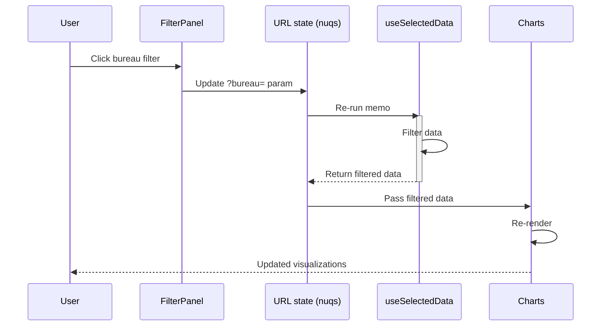
```mermaid
sequenceDiagram
    participant User
    participant FilterPanel
    participant State as URL state (nuqs)
    participant selectData as useSelectedData
    participant Charts
    
    User->>FilterPanel: Click bureau filter
    FilterPanel->>State: Update ?bureau= param
    State->>selectData: Re-run memo
    activate selectData
    selectData->>selectData: Filter data
    selectData-->>State: Return filtered data
    deactivate selectData
    State->>Charts: Pass filtered data
    Charts->>Charts: Re-render
    Charts-->>User: Updated visualizations
```

### 3. Chart Rendering

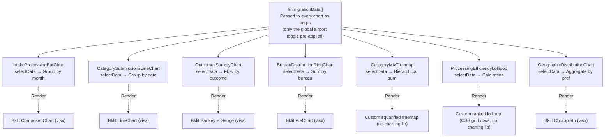
```mermaid
graph TD
    RAW["ImmigrationData[]<br/>Passed to every chart as props<br/>(only the global airport toggle pre-applied)"]
    INTAKE["IntakeProcessingBarChart<br/>selectData → Group by month"]
    TYPES["CategorySubmissionsLineChart<br/>selectData → Group by date"]
    OUTCOMES["OutcomesSankeyChart<br/>selectData → Flow by outcome"]
    SHARE["BureauDistributionRingChart<br/>selectData → Sum by bureau"]
    MIX["CategoryMixTreemap<br/>selectData → Hierarchical sum"]
    EFFICIENCY["ProcessingEfficiencyLollipop<br/>selectData → Calc ratios"]
    MAP["GeographicDistributionChart<br/>selectData → Aggregate by pref"]
    
    RAW --> INTAKE
    RAW --> TYPES
    RAW --> OUTCOMES
    RAW --> SHARE
    RAW --> MIX
    RAW --> EFFICIENCY
    RAW --> MAP
    
    INTAKE -.->|Render| VIZ1["Bklit ComposedChart (visx)"]
    TYPES -.->|Render| VIZ2["Bklit LineChart (visx)"]
    OUTCOMES -.->|Render| VIZ3["Bklit Sankey + Gauge (visx)"]
    SHARE -.->|Render| VIZ4["Bklit PieChart (visx)"]
    MIX -.->|Render| VIZ5["Custom squarified treemap (no charting lib)"]
    EFFICIENCY -.->|Render| VIZ6["Custom ranked lollipop (CSS grid rows, no charting lib)"]
    MAP -.->|Render| VIZ7["Bklit Choropleth (visx)"]
```

Each chart calls `selectData` independently with its own bureau/type/range selection — there's no shared, pre-filtered dataset (see [Single-Pass Filtering](#single-pass-filtering)). The one global exception is the airport toggle: when airport offices are excluded, `DashboardShell` runs the array through `excludeAirportData` before it reaches any chart, stat, or table — the airport rows are dropped and their volumes subtracted from the nationwide aggregate row, so totals reflect only the visible bureaus (the estimator keeps the full dataset). `visx` is used inside the vendored Bklit chart library only; the two custom charts (Category Mix Treemap, Processing Efficiency) don't depend on it.

A sibling `CategoryMixSunburst.tsx` renders the same hierarchy (shared `categoryMixTree.ts`) as a sunburst instead of a treemap, and `ProcessingEfficiencyQuadrantChart.tsx` renders the efficiency data (shared `processingEfficiency.ts`) as a quadrant scatter; neither is currently wired into the chart tab registry.

The Resident Population dataset's six charts follow the same independent-`selectData`-call pattern, against `useSelectedResidents`/`residentsSelectors.ts` instead:

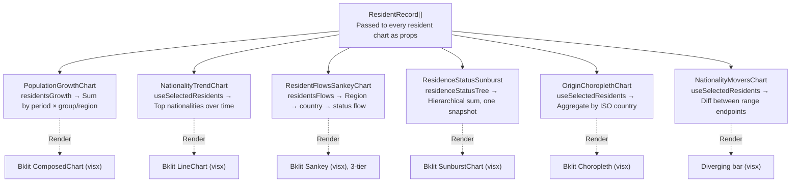
```mermaid
graph TD
    RRAW["ResidentRecord[]<br/>Passed to every resident chart as props"]
    GROWTH["PopulationGrowthChart<br/>residentsGrowth → Sum by period × group/region"]
    ORIGINS["NationalityTrendChart<br/>useSelectedResidents → Top nationalities over time"]
    FLOWS["ResidentFlowsSankeyChart<br/>residentsFlows → Region → country → status flow"]
    STATUSES["ResidenceStatusSunburst<br/>residenceStatusTree → Hierarchical sum, one snapshot"]
    WORLD["OriginChoroplethChart<br/>useSelectedResidents → Aggregate by ISO country"]
    MOVERS["NationalityMoversChart<br/>useSelectedResidents → Diff between range endpoints"]

    RRAW --> GROWTH
    RRAW --> ORIGINS
    RRAW --> FLOWS
    RRAW --> STATUSES
    RRAW --> WORLD
    RRAW --> MOVERS

    GROWTH -.->|Render| RVIZ1["Bklit ComposedChart (visx)"]
    ORIGINS -.->|Render| RVIZ2["Bklit LineChart (visx)"]
    FLOWS -.->|Render| RVIZ3["Bklit Sankey (visx), 3-tier"]
    STATUSES -.->|Render| RVIZ4["Bklit SunburstChart (visx)"]
    WORLD -.->|Render| RVIZ5["Bklit Choropleth (visx)"]
    MOVERS -.->|Render| RVIZ6["Diverging bar (visx)"]
```

`growth`, `origins`, and `movers` sum over a time window (`timeControl: 'range'`); `flows`, `statuses`, and `worldmap` show one half-yearly snapshot (`timeControl: 'snapshot'`), picked with `SnapshotPeriodSelector` instead of the range picker. A sibling `ResidenceStatusMixChart.tsx` renders the same `residenceStatusTree.ts` hierarchy as a zoomable treemap instead of a sunburst — the same swap-ready-alternate relationship as `CategoryMixTreemap`/`CategoryMixSunburst`, just with the sunburst as the live registry entry this time; it isn't currently wired into the chart tab registry.

## Component Architecture

### Component Hierarchy


```mermaid
graph TD
    APP["🏠 page.tsx<br/>+ client.tsx providers"]
    
    APP --> ERROR["🚨 ErrorBoundary<br/>Error Catching"]
    APP --> THEME["🎨 ThemeProvider<br/>next-themes adapter"]
    APP --> SHELL["📐 DashboardShell<br/>Header + Tabs + Footer"]
    
    SHELL --> FILTER["🔍 FilterPanel<br/>Bureau & Application Type"]
    SHELL --> RFILTER["🔍 ResidentFilterPanel<br/>Region, Nationality & Status Group"]
    SHELL --> STATS["📊 StatsSummary<br/>Summary Stat Cards"]
    SHELL --> RSTATS["📊 ResidentsStatsSummary<br/>Summary Stat Cards"]
    SHELL --> ACTIVE["🔀 ActiveChart<br/>Renders the selected tab"]
    SHELL --> TABLE["📋 ChartDataTable<br/>Per-chart data table + CSV export"]
    SHELL --> ESTIMATOR["⏱️ EstimationCard<br/>Queue Predictor"]
    SHELL --> CHANGELOG["📰 ChangelogModal<br/>Opened from the version link"]
    
    ACTIVE --> CHARTS["ChartComponents registry"]
    CHARTS --> INTAKE["📊 IntakeProcessingBarChart"]
    CHARTS --> TYPES["📈 CategorySubmissionsLineChart"]
    CHARTS --> OUTCOMES["🔀 OutcomesSankeyChart"]
    CHARTS --> SHARE["🍩 BureauDistributionRingChart"]
    CHARTS --> MIX["🗂️ CategoryMixTreemap"]
    CHARTS --> EFFICIENCY["🍭 ProcessingEfficiencyLollipop"]
    CHARTS --> MAP["🗾 GeographicDistributionChart"]
    CHARTS --> GROWTH["📈 PopulationGrowthChart"]
    CHARTS --> ORIGINS["📉 NationalityTrendChart"]
    CHARTS --> FLOWS["🔀 ResidentFlowsSankeyChart"]
    CHARTS --> STATUSES["☀️ ResidenceStatusSunburst"]
    CHARTS --> WORLD["🌐 OriginChoroplethChart"]
    CHARTS --> MOVERS["⚖️ NationalityMoversChart"]
    
    style APP fill:#4CAF50,color:#fff
    style SHELL fill:#2196F3,color:#fff
    style ERROR fill:#F44336,color:#fff
    style THEME fill:#FF9800,color:#fff
    style FILTER fill:#9C27B0,color:#fff
    style CHARTS fill:#00BCD4,color:#fff
```

### Key Components

#### **Page / Client Wrapper** (`src/app/[[...slug]]/page.tsx`, `client.tsx`)

`page.tsx` is a thin static-params wrapper; `client.tsx` sets up the client providers (nuqs URL adapter, ThemeProvider, LocaleProvider, TooltipProvider, ErrorBoundary) and dynamically imports `App.tsx` (`ssr: false`). `App.tsx` calls `useImmigrationData` and renders `DashboardShell` once data is loaded.

#### **Localization** (`src/i18n/`)

Every user-visible string resolves through a per-language catalogue; `src/i18n/README.md` is the reference. Two things are worth knowing before working elsewhere in the tree:

- **Domain constants carry no display text.** `bureauOptions`, `applicationOptions`, `japanPrefectures`, and `CHART_COMPONENTS` hold codes, geometry, and capability flags only. Names come from the catalogue, joined back by the hooks in `useDomainLabels.ts`. Consequently a bureau's name can only be resolved inside a component — utilities that need one take a resolver argument (`computeEfficiencyPoints`).
- **A growing set of vendored Bklit files are locally modified.** `charts/chart-formatters.ts` and `charts/chart-stat-flow.tsx` had their `Intl` locale hardcoded to `en-US` (and, in one case, left to the browser); `charts/y-axis.tsx` built tick labels with an English `${n / 1000}k` suffix. Those three now read module state that `LocaleProvider` sets during render. `charts/sankey/sankey-tooltip.tsx` hardcoded its two row labels, and takes `valueLabel` / `linkLabel` props instead. Two further changes came out of actually rendering Japanese: `chart-stat-flow.tsx` also passes `locales` to `NumberFlow`, which otherwise reverted to the browser locale once the animation library loaded, and `y-axis.tsx` marks tick labels `whitespace-nowrap`, because `100万` breaks across two lines in a fixed-width axis margin. That fixed width turned out to be the deeper bug: once five more locales shipped in v1.2.5, German/Portuguese/Spanish/Italian's own compact-number forms ("1,2 Mio.", "800 mil") were wider than the English-sized margin `whitespace-nowrap` was overflowing *into* — and a `.card-content` CSS rule was silently re-clipping that overflow besides (`overflow-x: visible` and `overflow-y: auto` can't coexist on one element per the CSS overflow spec; the browser coerces the visible axis back to `auto`). `chart-formatters.ts` now exports `estimateAxisMarginLeft()` / `measureLabelWidth()`, real `canvas.measureText` calls against the current locale's rendered output, and `line-chart.tsx`, `bar-chart.tsx`, `area-chart.tsx`, and `composed-chart.tsx` all consult it when resolving their margin instead of the vendored flat 40px; `bar-y-axis.tsx`'s category-label width is measured the same way. Chart components route through a new `chart-card-content` utility (in `src/index.css`, not vendored) rather than the shared `card-content` class, so they never inherit the coupling bug in the first place. `chart-formatters.ts`'s `compactFmt` also now guards against an ICU quirk (observed on de-DE and it-IT in an older bundled Chromium) where compact notation silently fails to abbreviate at all in the low hundred-thousands — detected by comparing against genuinely-unabbreviated standard notation, so locales whose compact notation works correctly are untouched. `charts/tooltip/chart-tooltip.tsx` carries two changes of its own: a `titleFormat` prop, because the vendored weekday+month+day title has no year and a meaningless weekday on the half-yearly and monthly charts, and a `dotKeys` allowlist that narrows the hover-dot layer to named series. The second exists because `ComposedChart` registers a zero-width line per `SeriesBar` so bars appear in the tooltip, and the dot layer places those at the raw axis value rather than the stacked segment top — every segment above the bottom one lands in the wrong place. Population Growth turns dots off outright (`showDots={false}`, all bars); Intake & Processing passes `dotKeys={['processed', 'approvalRate']}` to keep dots on its two real lines. Three more changes came out of giving Intake & Processing an approval-rate axis, all of them limitations rather than localization. `charts/time-series-chart-shell.tsx` and `charts/y-domain-utils.ts` carry most of it: `yScaleDomainMax` — the stacked-bar total — was gated behind "every series is on the default axis", so adding a second axis silently dropped it and rescaled the primary axis to the tallest single segment, overflowing the plot; it is keyed on the axis id now. They also accept `yAxisDomains`, axes pinned to a fixed domain and used verbatim rather than nice()'d and padded, which is what holds the approval-rate axis at 0–100% whatever the rate does, and a projection is no longer allowed to widen a pinned axis. `charts/composed-chart.tsx` threads that prop through and no longer lets a series on a secondary axis raise the primary axis maximum — harmless while a percentage is the only such series, but wrong for one measured in raw units. `charts/use-animated-series-path.ts` carries a fix rather than a feature: its transition effect only did work when the *transition signature* changed — x-domain, width and the raw y values — but listed the scales and data in its dependency array. A y-domain tween hands every series a new y-scale on each of its frames, so the effect re-ran, its cleanup stopped the animation, and the body then early-returned on the unchanged signature. `onComplete` is the only place the animated snapshot is released, and stopping skips it, so the path stayed pinned to pixels from the domain the chart had *before* the change — visible as a line collapsed onto the baseline after a filter change, while its tooltip dot (recomputed live at hover time) sat correctly. The volatile inputs are read through a ref now, the deps match the guard the body applies, and the cleanup releases the snapshot too. Reading the scale live is also what recomputing the target every frame was always for: the path morph and the domain tween compose, so a line follows its axis as it rescales. `scripts/vendor-bklit.mjs` would overwrite every file listed here — re-apply after a re-vendor. Each file says so at the point of change.
- **A second set of vendored changes makes tooltips tappable.** These are listed as a table rather than folded into the paragraph above, because they follow one rule applied in many places instead of a different fix per file. The rule: on a coarse pointer (`(hover: none) and (pointer: coarse)`, read via `src/hooks/useCoarsePointer.ts`) hover handlers are **not attached at all**, and the tooltip is driven from `onClick`. Leaving them off rather than guarding them is what stops the compatibility mouse events a browser fires ~300ms after `touchend` from re-opening or clearing a tooltip a tap has just pinned. `src/lib/tooltip-pin.ts` enforces one pinned tooltip per page and owns outside-tap / scroll / Escape dismissal; `src/hooks/useTapPin.ts` is the per-chart half, and its `activationProps()` helper is the one-line swap at each call site. All three are app-owned and survive a re-vendor; the files below do not.

  | Vendored file | Change |
  |---|---|
  | `charts/use-chart-interaction.ts` | Touch handlers (and the two-finger range selection) replaced by one `onClick`; `touch-action` becomes `manipulation` on touch, so tall charts stop being a page-scroll dead zone. Separately, a `mousedown` no longer clears the tooltip outright — it arms a drag that only starts, and only clears, once the cursor travels past `DRAG_THRESHOLD_PX`. The vendored code had to assume every press was the start of a range drag, so on a hover device clicking a chart looked like it dismissed the tooltip |
  | `charts/time-series-chart-shell.tsx` | `touch-action` moved to the `<svg>` (nested SVG support for it is patchy); axis-gutter tap dismisses |
  | `charts/use-scheduled-tooltip.ts` | Adds `commitTooltipNow`, so a datapoint that was unpinned can be re-pinned — the dedupe key otherwise survives the clear |
  | `charts/tooltip/tooltip-box.tsx` | The panel gains a `max-width`; its 140px floor with no ceiling could otherwise outgrow its own container on a narrow phone. It deliberately stays `pointer-events-none`: a tap on a pinned panel should fall through to the datapoint beneath, which is what makes both "tap the same point to close" and "tap the neighbouring point to move" work when the panel covers them. An `anchorAboveY` prop adds a second placement — above the touch, centred on it — clamped to the *viewport* rather than the container, because on a phone the plot is ~170px against a panel of 116–194px, so nothing fits inside it and every ancestor up to the card is `overflow: visible` anyway |
  | `charts/tooltip/chart-tooltip.tsx` | Passes `anchorAboveY` from `tooltipData.tapY`, and drops the vendored `top={margin.top}` override while it is set — pinning the panel to the top of the plot is what made it cover the data and the date axis on a phone |
  | `charts/sankey/sankey-tooltip.tsx` | Same `anchorAboveY`, because its position comes from `mousePos`, which on touch *is* the tap — so the vendored placement centred the panel on the very point being read |
  | `charts/sunburst-{chart,context,segment}.tsx` | First tap inspects, second zooms |
  | `charts/sankey/{sankey-chart,sankey-context,sankey-node,sankey-link}.tsx` | Tap position recorded on `pointerdown`, since node/link clicks stop propagating |
  | `charts/choropleth/{choropleth-chart,choropleth-context,choropleth-feature}.tsx` | Layered on top of the delegation described under [Local patches to the vendored choropleth](#local-patches-to-the-vendored-choropleth): an `onFeatureTap` prop replaces the delegated `onMouseOver`/`onMouseLeave` pair on a coarse pointer, so a second tap on the same prefecture dismisses it and the pin registers page-wide. Gesture handling and `touch-action: pan-y` are that section's, not this one's |
  | `charts/{pie-chart,pie-context,pie-slice}.tsx` | `tapMode` supplied by the chart owner, so slices and the app-side legend share one pin |
  | `charts/markers/marker-group.tsx` | The marker fan opens on tap. Separately, a `fan` prop (added here and forwarded by `charts/markers/chart-markers.tsx`) turns the fan-out off entirely, which the policy markers on Intake & Processing and Population Growth both pass: the 50px fan arc reached straight through the neighbouring markers on a monthly axis, and the icons it threw carried no label to say where they led. A period holding several events stays one badged circle instead, and the crosshair tooltip reads them out. Those markers carry no `onClick` or `href` at all — they are annotation, not navigation, and the collapsible list under each chart is where every source lives |

  Deliberately **not** converted, because nothing outside `src/components/bklit/` imports them: `use-scatter-chart-interaction.ts`, `scatter-chart-shell.tsx`, `bar-chart.tsx` (the bar charts are `ComposedChart` + `SeriesBar`), `radar-area.tsx`, `legend/legend-item.tsx`, `ring.tsx`. Each would be a permanent re-vendor cost for no user-visible gain. Also still open: `src/components/ui/tooltip.tsx` (Radix) never opens on touch at all — `src/components/common/FormulaTooltip.tsx` shows the Popover pattern that fixes it.

- **Domain names come in three widths.** `bureau.*` and `appType.*` each carry `.label`, `.compact`, and `.short`, resolved together by `useDomainLabels.ts`. The width-constrained surfaces — the efficiency chart's 92px label column, the ring-chart legend, the treemap tile, and the Sankey's narrow layout — read `.compact`; everything with room reads `.label`. English says the same thing at every width, so this is invisible there; Japanese needs it, because 東京出入国在留管理局横浜支局 and 東京出入国在留管理局成田空港支局 truncate identically.

The language switcher is gated behind `LOCALE_SWITCHER_ENABLED` in `src/i18n/config.ts`, which also gates browser-language detection — one flag for both, because auto-detecting a language is only safe while the visitor has a visible way back. It is on, now that all eleven non-English locales are fully translated.

#### **DashboardShell** (`src/components/DashboardShell.tsx`)

The single responsive shell that:
- Renders the header, chart tabs, filter bar, data table (passing the active chart's `table` id through to `ChartDataTable`), and footer
- Owns the URL-first state (`chart`, `bureau`, `type`, `range`, `compare`, `airports` query params via nuqs)
- Hosts the Processing Time Estimator as a collapsible desktop sidebar or a mobile bottom sheet
- Coordinates all child components

#### **FilterPanel** (`src/components/FilterPanel.tsx`)

Controls for filtering the Application Processing dataset:
- Bureau selection (single-select, plus an optional "Compare With" second bureau)
- Application type selection
- A global airport toggle (beside the reset button) that removes the airport branch offices from every chart, stat, and table — their volumes are also subtracted from the nationwide totals, and they drop out of the bureau/compare dropdowns while active
- Filter availability is driven per-chart by the `ChartComponents` registry
- Filters are applied to whichever chart is active

#### **ResidentFilterPanel** (`src/components/ResidentFilterPanel.tsx`)

Controls for filtering the Resident Population dataset:
- World region selection, cascading into the nationality list — picking a region narrows the country options to that region's members, and clears an out-of-region nationality selection
- Nationality selection
- Status group selection — 6 purpose-of-stay groups (work, training, residency, and so on), replacing the raw 39 residence-status codes; legacy permalinks built from the old individual codes still resolve, mapped onto their group
- Filter availability is driven per-chart by the `ChartComponents` registry, same as `FilterPanel`
- No bureau, application type, or airport toggle — neither dimension exists in this cube

#### **Chart Components** (`src/components/charts/`)

Thirteen chart components across both datasets, registered in `src/components/common/ChartComponents.tsx` and rendered as tabs.

Seven for Application Processing:

| Component | Library | Purpose |
|-----------|---------|---------|
| IntakeProcessingBarChart | Bklit ComposedChart | Intake/Processing trends and approval rate |
| CategorySubmissionsLineChart | Bklit LineChart | Submission trends over time |
| OutcomesSankeyChart | Bklit Sankey + Gauge | Application outcomes flow + approval rate |
| BureauDistributionRingChart | Bklit PieChart | Bureau share of intake |
| CategoryMixTreemap | Custom squarified treemap (no charting lib) | Applications by type and bureau |
| ProcessingEfficiencyLollipop | Custom CSS grid rows (no charting lib) | Bureaus ranked by completion rate, stems weighted by intake |
| GeographicDistributionChart | Bklit Choropleth (visx) | Geographic distribution |

Two swap-ready alternates live beside them, unwired from the registry: `CategoryMixSunburst.tsx` (the Category Mix hierarchy as a sunburst) and `ProcessingEfficiencyQuadrantChart.tsx` (Processing Efficiency as a quadrant scatter — completion rate against intake volume, split at the period medians, d3-scale + raw SVG). Each shares its live sibling's data contract, so swapping is a one-line registry change.

Six for Resident Population, in tab order (the narrative: how the total grew → who grew → how origin and status cross-tabulate → the status detail → where on the map → what changed most recently):

| Component | Library | Purpose |
|-----------|---------|---------|
| PopulationGrowthChart | Bklit ComposedChart (visx) | Total residents per half-year, by status group or region |
| NationalityTrendChart | Bklit LineChart (visx) | Largest nationalities across the whole period |
| ResidentFlowsSankeyChart | Bklit Sankey (visx), 3-tier | Region → country → status group, one snapshot |
| ResidenceStatusSunburst | Bklit SunburstChart (visx) | A nationality's visas by purpose of stay, one snapshot |
| OriginChoroplethChart | Bklit Choropleth (visx) | Resident count by country of origin, log scale |
| NationalityMoversChart | Diverging bar (visx) | Largest gains/losses between two points in time |

A swap-ready alternate lives beside `ResidenceStatusSunburst`, unwired from the registry: `ResidenceStatusMixChart.tsx` renders the same `residenceStatusTree.ts` hierarchy as a zoomable treemap instead — the same pattern as `CategoryMixTreemap`/`CategoryMixSunburst`, just with the sunburst as the live entry.

Each chart:
- Receives pre-filtered data as props
- Manages its own visualization state
- Is self-contained and reusable

#### **ChartDataTable** (`src/components/ChartDataTable.tsx`)

The collapsible text alternative under each Application Processing chart, and the app's only CSV export.

It holds no domain knowledge. Every chart's registry entry names a `ProcessingTableId`, and the shapes and their selector math live in `src/utils/chartTables.ts` keyed on that id; the component renders whichever `TableModel` comes back. That is what lets the row axis vary — months under Intake and Application Types, bureaus under Bureau Share, Category Mix and Processing Efficiency, application types under Outcomes, prefectures under the Regional Map — without the component knowing the difference.

Each builder reads its numbers from the same helper its chart does (`buildCategoryMixTree` for the treemap, `computeBureauVolumes` for the lollipop, the ring chart's own status pair for the donut), so a table cannot drift from the chart above it. The field was made required on `ProcessingChartDefinition` deliberately: the table was previously a single hardcoded month × status pivot mounted under all seven charts, which described only `intake`, and requiring the declaration is what stops the next chart being added without anyone deciding.

Labels travel as `LabelRef` — a catalogue key, or a language-neutral literal — rather than as resolved text, so the DOM can resolve them through the locale-bound `t` while `src/utils/chartTableCsv.ts` resolves the same refs against English. That is what keeps the export English-only by construction now that rows and cells carry names and not just months, and `csvField` quotes per RFC 4180 so a value containing a separator cannot split a row.

#### **EstimationCard** (`src/components/EstimationCard.tsx`)

Interactive queue position estimator:
- Accepts user input (bureau, application type, submission date)
- Calls `calculateEstimatedDate` (`src/utils/calculateEstimates.ts`)
- Displays a "Show the math" breakdown with KaTeX formulas (`EstimationFormula`, in step cards from `FormulaTooltip`). `buildFormulaSteps` is a pure function of the model variables and the branch record `calculateEstimatedDate` returns, so the dependency ordering between steps is unit-tested rather than assumed
- Generates shareable permalinks (`src/utils/urlApplicationDetails.ts`)

#### **StatsSummary** (`src/components/StatsSummary.tsx`)

Summary statistics display, built from `StatCard` (`src/components/common/StatCard.tsx`):
- Shows key metrics (submissions, processed, approval rate, etc.), animated with a custom `useCountUp` hook (`src/lib/motion.ts`, built on Anime.js) — `@number-flow/react` is a real dependency but is used only inside the vendored Bklit charts' gauge/ring/pie centers, not here
- Updates based on filters
- Responsive layout for mobile

### Header & Footer

There is no separate `layouts/` directory — the header (branding, language switcher, theme toggle, source-repository link, changelog trigger) and footer (attribution, e-Stat credit) markup live directly inside `DashboardShell.tsx`. The language switcher renders nothing while `LOCALE_SWITCHER_ENABLED` is false (see below); it is on today. The source-repository link is an icon button on desktop and a row under About in the mobile settings drawer.

#### **ErrorBoundary** (`src/components/common/ErrorBoundary.tsx`)
- Catches React errors
- Displays user-friendly error message
- Prevents blank page on crash

## State Management

### State Architecture

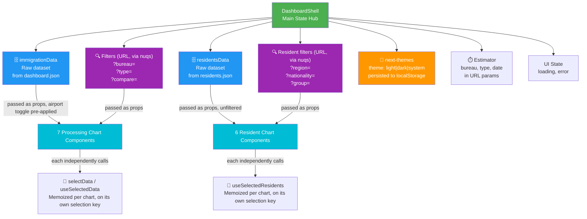
```mermaid
graph TD
    SHELL["DashboardShell<br/>Main State Hub"]
    
    DATA["🗄️ immigrationData<br/>Raw dataset<br/>from dashboard.json"]
    RDATA["🗄️ residentsData<br/>Raw dataset<br/>from residents.json"]
    
    FILTERS["🔍 Filters (URL, via nuqs)<br/>?bureau=<br/>?type=<br/>?compare="]
    RFILTERS["🔍 Resident filters (URL, via nuqs)<br/>?region=<br/>?nationality=<br/>?group="]
    
    THEME["🎨 next-themes<br/>theme: light|dark|system<br/>persisted to localStorage"]
    
    ESTIMATOR["⏱️ Estimator<br/>bureau, type, date<br/>in URL params"]
    
    UI["UI State<br/>loading, error"]
    
    SHELL --> DATA
    SHELL --> RDATA
    SHELL --> FILTERS
    SHELL --> RFILTERS
    SHELL --> THEME
    SHELL --> ESTIMATOR
    SHELL --> UI
    
    DATA -->|passed as props, airport toggle pre-applied| CHARTS["7 Processing Chart Components"]
    FILTERS -->|passed as props| CHARTS
    CHARTS -->|each independently calls| FILTERED["🔄 selectData / useSelectedData<br/>Memoized per chart, on its own selection key"]

    RDATA -->|passed as props, unfiltered| RCHARTS["6 Resident Chart Components"]
    RFILTERS -->|passed as props| RCHARTS
    RCHARTS -->|each independently calls| RFILTERED["🔄 useSelectedResidents<br/>Memoized per chart, on its own selection key"]
    
    style SHELL fill:#4CAF50,color:#fff
    style DATA fill:#2196F3,color:#fff
    style RDATA fill:#2196F3,color:#fff
    style FILTERS fill:#9C27B0,color:#fff
    style RFILTERS fill:#9C27B0,color:#fff
    style THEME fill:#FF9800,color:#fff
    style CHARTS fill:#00BCD4,color:#fff
    style RCHARTS fill:#00BCD4,color:#fff
```

### Why No Redux/Zustand?

**Design Decision:** React's built-in state + hooks is sufficient because:

1. **Simple Data Flow** — Unidirectional: raw data + URL filters flow down as props; each chart derives its own view via `selectData`
2. **Localized Updates** — Most state changes are isolated to a few components
3. **Performance** — Memoization (`useMemo`, `useCallback`) is sufficient
4. **Reduced Complexity** — Smaller learning curve for contributors
5. **Bundle Size** — No additional dependency overhead

## Data Processing Pipeline

### 1. Client-Side Data Shape

The `ImmigrationData` record the client loads and filters (`src/hooks/useImmigrationData.ts`):

```typescript
interface ImmigrationData {
  month: string;    // "2026-07"
  bureau: string;    // e-Stat bureau code
  type: string;       // application type code
  value: number;
  status: string;     // e-Stat status code
}
```

`public/data/dashboard.json` stores this as a packed schema (index tables + flat value tuples, ~10x smaller than the raw payload) that `unpackDashboardData` (`src/utils/dashboardData.ts`) expands back into `ImmigrationData[]`.

The Resident Population dataset is a second, independent cube with its own record, its own packed file, and its own selectors (`src/utils/residentsData.ts`, `residentsSelectors.ts`):

```typescript
interface ResidentRecord {
  period: string;       // "2025-12" — a half-year snapshot, not a month
  status: string;       // e-Stat cat01 residence-status code
  nationality: string;  // e-Stat cat02 nationality/region code
  value: number;
}
```

The two share no dimension, so they are never merged: `ChartDefinition` is a union discriminated on `dataset`, and the shell narrows on it to pick the filter shape, the range vocabulary, and the props each chart gets. `meta.kind` on the residents file (stride 4) is what stops it being read by the processing unpacker (stride 5), which would otherwise produce three-quarters as many plausible-looking nonsense records rather than an error.

Each `ChartDefinition` also carries a `timeControl`, `'range'` or `'snapshot'`. `growth`, `origins`, and `movers` sum over a picked time window, same as the processing charts; `flows`, `statuses`, and `worldmap` are "stock" figures — one half-yearly snapshot rather than a sum — and use `SnapshotPeriodSelector` (`src/components/common/SnapshotPeriodSelector.tsx`) in place of the range picker. `residentPeriod.ts` formats and orders the half-yearly period strings both controls share.

Filtering is a `region`/`nationality`/`group` triple rather than processing's `bureau`/`type`: `region` narrows `nationality` (a country belongs to exactly one of the world regions declared in `nationalities.ts`), and `group` is the 6-way purpose-of-stay grouping declared in `residenceStatusTree.ts`, replacing the 39 raw e-Stat status codes for filtering purposes. `residentUrlParams.ts` parses both the current group-based URL params and the legacy individual-status-code params from pre-#78 permalinks, mapping the latter onto their group so old shared links keep resolving. `residentsGrowth.ts` builds the growth chart's per-period series (status-group and region breakdowns, plus an `indexSeries()` helper for normalized trend comparisons) and `residentsFlows.ts` builds the sankey's three-tier region→country→status flow, including top-N country selection with an "other" bucket for the long tail. `constants/japanPopulation.ts` is a static year-by-year lookup of Japan's total population, used only as the denominator for the "share of total population" figure in `ResidentsStatsSummary`.

### 2. Build-Time vs. Runtime Pipeline

Bureau-aggregate correction (deaggregation) now happens **once at build time**, not on every page load:

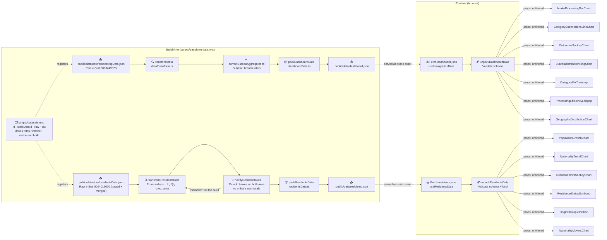
```mermaid
graph LR
    subgraph "Build time (scripts/transform-data.mts)"
        MANIFEST["🗂️ scripts/datasets.mjs<br/>id · statsDataId · raw · out<br/>drives fetch, watcher, cache and build"]

        RAW["📥 public/datastore/processingData.json<br/>Raw e-Stat 0003449073"]
        FLATTEN["🔍 transformData<br/>dataTransform.ts"]
        CORRECT["➖ correctBureauAggregates.ts<br/>Subtract branch totals"]
        PACK["📦 packDashboardData<br/>dashboardData.ts"]
        OUT["📤 public/data/dashboard.json"]

        MANIFEST -.->|registers| RAW
        RAW --> FLATTEN
        FLATTEN --> CORRECT
        CORRECT --> PACK
        PACK --> OUT

        RRAW["📥 public/datastore/residentsData.json<br/>Raw e-Stat 0004019020 (paged + merged)"]
        RFLAT["🔍 transformResidentsData<br/>Prune rollups, 「うち」 rows, zeros"]
        RVERIFY["✅ verifyResidentTotals<br/>Re-add leaves on both axes<br/>vs e-Stat's own totals"]
        RPACK["📦 packResidentsData<br/>residentsData.ts"]
        ROUT["📤 public/data/residents.json"]

        MANIFEST -.->|registers| RRAW
        RRAW --> RFLAT
        RFLAT --> RVERIFY
        RVERIFY -->|mismatch: fail the build| RFLAT
        RVERIFY --> RPACK
        RPACK --> ROUT
    end

    subgraph "Runtime (browser)"
        FETCH["📥 Fetch dashboard.json<br/>useImmigrationData"]
        UNPACK["🔓 unpackDashboardData<br/>Validate schema"]
        RFETCH["📥 Fetch residents.json<br/>useResidentsData"]
        RUNPACK["🔓 unpackResidentsData<br/>Validate schema + kind"]

        FETCH --> UNPACK
        RFETCH --> RUNPACK
    end

    OUT -.->|served as static asset| FETCH
    ROUT -.->|served as static asset| RFETCH

    UNPACK -->|props, unfiltered| INTAKE["IntakeProcessingBarChart"]
    UNPACK -->|props, unfiltered| TYPES["CategorySubmissionsLineChart"]
    UNPACK -->|props, unfiltered| OUTCOMES["OutcomesSankeyChart"]
    UNPACK -->|props, unfiltered| SHARE["BureauDistributionRingChart"]
    UNPACK -->|props, unfiltered| MIX["CategoryMixTreemap"]
    UNPACK -->|props, unfiltered| EFFICIENCY["ProcessingEfficiencyLollipop"]
    UNPACK -->|props, unfiltered| MAP["GeographicDistributionChart"]

    RUNPACK -->|props, unfiltered| GROWTH["PopulationGrowthChart"]
    RUNPACK -->|props, unfiltered| ORIGINS["NationalityTrendChart"]
    RUNPACK -->|props, unfiltered| FLOWS["ResidentFlowsSankeyChart"]
    RUNPACK -->|props, unfiltered| STATUSES["ResidenceStatusSunburst"]
    RUNPACK -->|props, unfiltered| WORLD["OriginChoroplethChart"]
    RUNPACK -->|props, unfiltered| MOVERS["NationalityMoversChart"]
```

The two chains share no dimension, so they share no code path — but they do share a
lifecycle, and it is written once. `transform-data.mts` walks `scripts/datasets.mjs` and
runs each entry through the same sequence (fixture fallback → completeness check →
transform → optional verify → pack → report), dispatching the cube-specific parts through
a handler table keyed by dataset id. The manifest is also what the fetch script, the
watcher and the Actions cache read, so a dataset is registered in exactly one place; see
[Adding a dataset](DEVELOPMENT.md#adding-a-dataset).

Both files are fetched eagerly at boot (`src/App.tsx`), so switching datasets is instant. A failure to load the residents file is not fatal: the shell disables that half of the switcher and the processing dashboard carries on.

Each chart then independently calls `selectData`/`useSelectedData` (`src/utils/selectors.ts`), memoized on its own selection key — there's no shared, pre-filtered dataset (see [Single-Pass Filtering](#single-pass-filtering)). "Unfiltered" has one global exception: with the airport toggle off, `DashboardShell` drops the airport branch offices' rows and subtracts their volumes from the nationwide aggregate before the props are passed (`src/utils/excludeAirportData.ts`).

### 3. Data Deaggregation

Some bureaus (Shinagawa, Osaka, Nagoya, Fukuoka) are **aggregates** that include branch office data from e-Stat. Shinagawa (bureau code `101170`) is the renamed former "Tokyo" bureau (see `CHANGELOG.md` v0.5.2) — the raw e-Stat figure under that code still includes its branch offices' applications, so it isn't a separate entity sitting *alongside* Tokyo, it *is* the aggregate. This correction now runs once at build time (see the pipeline above), not per page load:

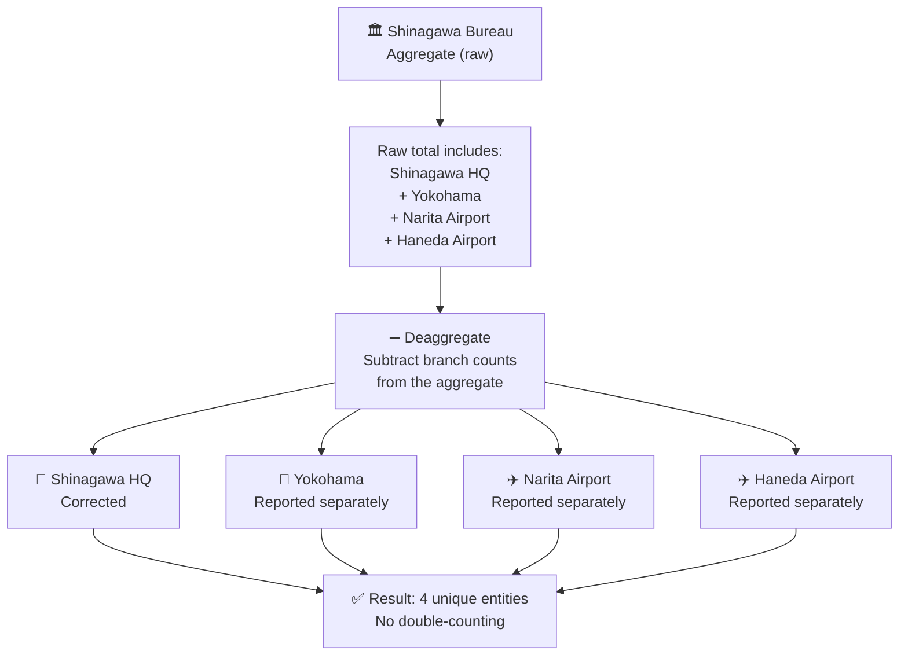
```mermaid
graph TD
    SHINAGAWA_AGG["🏛️ Shinagawa Bureau<br/>Aggregate (raw)"]
    SHINAGAWA_RAW["Raw total includes:<br/>Shinagawa HQ<br/>+ Yokohama<br/>+ Narita Airport<br/>+ Haneda Airport"]

    YOKOHAMA["🏢 Yokohama<br/>Reported separately"]
    NARITA["✈️ Narita Airport<br/>Reported separately"]
    HANEDA["✈️ Haneda Airport<br/>Reported separately"]

    DEAGG["➖ Deaggregate<br/>Subtract branch counts<br/>from the aggregate"]

    SHINAGAWA_AGG --> SHINAGAWA_RAW
    SHINAGAWA_RAW --> DEAGG
    DEAGG --> SHINAGAWA_HQ["🏢 Shinagawa HQ<br/>Corrected"]
    DEAGG --> YOKOHAMA
    DEAGG --> NARITA
    DEAGG --> HANEDA

    RESULT["✅ Result: 4 unique entities<br/>No double-counting"]
    SHINAGAWA_HQ --> RESULT
    YOKOHAMA --> RESULT
    NARITA --> RESULT
    HANEDA --> RESULT
```

The residents cube needs a different correction, for the same class of reason — e-Stat's own metadata disagrees with its own totals. `src/constants/residenceStatuses.ts` declares the corrected status hierarchy (the payload misparents the 技能実習 sub-statuses to 特定技能合計 and leaves the five 身分・地位 statuses with no parent at all), and `src/constants/nationalities.ts` flags the nested 「うち」 rows that would double-count. `verifyResidentTotals` (`src/utils/residentsTransform.ts`) then checks the result against e-Stat's published 総数 rows on both axes and fails the build on any mismatch, because the failure mode is a chart that looks entirely plausible and is quietly wrong.

**Code Location:** `src/utils/correctBureauAggregates.ts` → `makeCorrectedAccessor()`, called from `src/utils/dataTransform.ts` → `transformData()` during `scripts/transform-data.mts` (build time). `getCorrectedValue()` subtracts the sum of a bureau's `children` codes (from `src/constants/bureauOptions.ts`) from its own raw value, so the aggregate code (e.g. `101170`) ends up representing only its own HQ processing, while each branch's own code (e.g. `101210` Yokohama) is left untouched. If a branch office hasn't published data for a period yet, that aggregate-bureau entry is skipped rather than emitted with an inflated value (see `isBranchDataIncomplete`).

### 4. Filtering & Memoization

This runs independently **inside each of the 13 chart components across both datasets** — there is no single shared cache distributed to all of them. Processing charts memoize through `selectData`/`useSelectedData` (`src/utils/selectors.ts`); residents charts memoize the same way through `useSelectedResidents` (`src/utils/residentsSelectors.ts`):

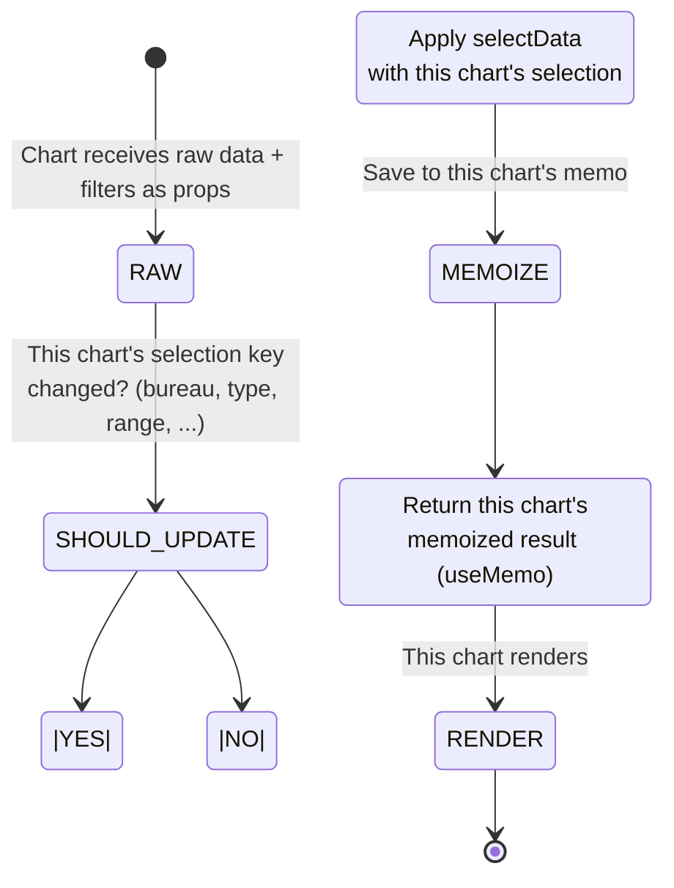
```mermaid
stateDiagram-v2
    [*] --> RAW: Chart receives raw data + filters as props

    RAW --> SHOULD_UPDATE: This chart's selection key<br/>changed? (bureau, type, range, ...)

    SHOULD_UPDATE --> |YES| FILTER: Apply selectData<br/>with this chart's selection
    SHOULD_UPDATE --> |NO| CACHE: Return this chart's<br/>memoized result (useMemo)

    FILTER --> MEMOIZE: Save to this chart's memo
    MEMOIZE --> CACHE

    CACHE --> RENDER: This chart renders
    RENDER --> [*]
```

### 5. Estimation Model

For processing time prediction:

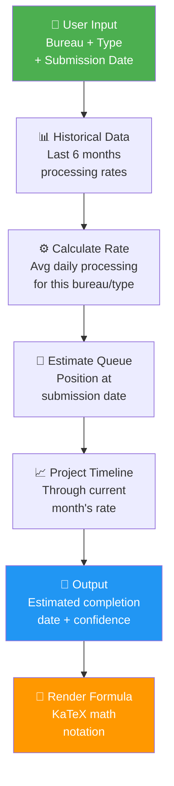
```mermaid
graph TD
    INPUT["📝 User Input<br/>Bureau + Type<br/>+ Submission Date"]
    
    HIST["📊 Historical Data<br/>Last 6 months<br/>processing rates"]
    
    RATE["⚙️ Calculate Rate<br/>Avg daily processing<br/>for this bureau/type"]
    
    QUEUE["🔢 Estimate Queue<br/>Position at<br/>submission date"]
    
    PROJECT["📈 Project Timeline<br/>Through current<br/>month's rate"]
    
    OUTPUT["📅 Output<br/>Estimated completion<br/>date + confidence"]
    
    LATEX["🔬 Render Formula<br/>KaTeX math<br/>notation"]
    
    INPUT --> HIST
    HIST --> RATE
    RATE --> QUEUE
    QUEUE --> PROJECT
    PROJECT --> OUTPUT
    OUTPUT --> LATEX
    
    style INPUT fill:#4CAF50,color:#fff
    style OUTPUT fill:#2196F3,color:#fff
    style LATEX fill:#FF9800,color:#fff
```

**Code Location:** `src/utils/calculateEstimates.ts` → `calculateEstimatedDate()`

## Performance Optimizations

### Optimization Strategies

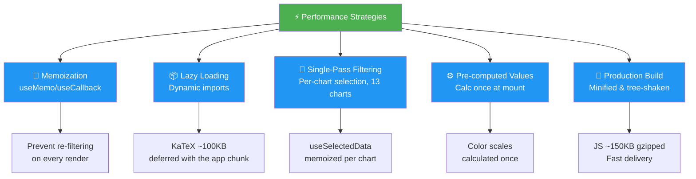
```mermaid
graph TD
    PERF["⚡ Performance Strategies"]
    
    PERF --> MEMO["📌 Memoization<br/>useMemo/useCallback"]
    PERF --> LAZY["📦 Lazy Loading<br/>Dynamic imports"]
    PERF --> SINGLE["🔄 Single-Pass Filtering<br/>Per-chart selection, 13 charts"]
    PERF --> PRECOMP["⚙️ Pre-computed Values<br/>Calc once at mount"]
    PERF --> BUILD["🔨 Production Build<br/>Minified & tree-shaken"]
    
    MEMO --> EXAMPLE1["Prevent re-filtering<br/>on every render"]
    LAZY --> EXAMPLE2["KaTeX ~100KB<br/>deferred with the app chunk"]
    SINGLE --> EXAMPLE3["useSelectedData<br/>memoized per chart"]
    PRECOMP --> EXAMPLE4["Color scales<br/>calculated once"]
    BUILD --> EXAMPLE5["JS ~150KB gzipped<br/>Fast delivery"]
    
    style PERF fill:#4CAF50,color:#fff
    style MEMO fill:#2196F3,color:#fff
    style LAZY fill:#2196F3,color:#fff
    style SINGLE fill:#2196F3,color:#fff
    style PRECOMP fill:#2196F3,color:#fff
    style BUILD fill:#2196F3,color:#fff
```

### Memoization Example

```typescript
// Prevent unnecessary re-calculations
const filteredData = useMemo(() => {
  return rawData.filter(...);
}, [rawData, selectedFilters]);

// Prevent unnecessary re-renders of child components
const memoizedCallback = useCallback(() => {
  handleFilter(value);
}, [value]);
```

### Lazy Loading Example

```typescript
// The entire dashboard is a client-only chunk, deferred until after
// the shell's providers mount (src/app/[[...slug]]/client.tsx):
const App = dynamic(() => import('../../App'), { ssr: false });
```

### Single-Pass Filtering

Each Application Processing chart calls `useSelectedData`/`selectData` (`src/utils/selectors.ts`) with the filters and range it needs; each Resident Population chart calls the analogous `useSelectedResidents` (`src/utils/residentsSelectors.ts`):
- Filtering is memoized per chart on its own selection key
- Charts that don't use a given filter (see the `ChartComponents` registry) simply don't pass it, avoiding redundant recomputation
- Distributed to 13 chart components via props, across both datasets

### Pre-Computed Values

```typescript
// A bureau's flag color, clamped to stay readable per theme
// (src/utils/bureauColors.ts):
const color = visibleBureauColor(bureauOption.background, isDarkMode);
```

## Type Safety

### Type Safety Strategy

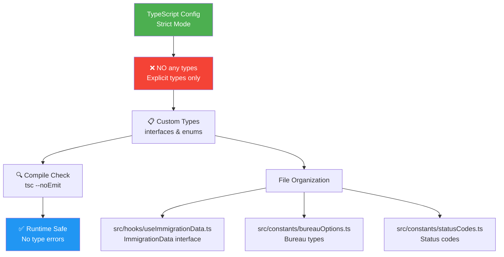
```mermaid
graph TD
    TSCONFIG["TypeScript Config<br/>Strict Mode"]
    NOANY["❌ NO any types<br/>Explicit types only"]
    TYPES["📋 Custom Types<br/>interfaces & enums"]
    COMPILE["🔍 Compile Check<br/>tsc --noEmit"]
    RUNTIME["✅ Runtime Safe<br/>No type errors"]
    
    TSCONFIG --> NOANY
    NOANY --> TYPES
    TYPES --> COMPILE
    COMPILE --> RUNTIME
    
    TYPES --> TYPEFILES["File Organization"]
    TYPEFILES --> TF1["src/hooks/useImmigrationData.ts<br/>ImmigrationData interface"]
    TYPEFILES --> TF2["src/constants/bureauOptions.ts<br/>Bureau types"]
    TYPEFILES --> TF3["src/constants/statusCodes.ts<br/>Status codes"]
    
    style TSCONFIG fill:#4CAF50,color:#fff
    style NOANY fill:#F44336,color:#fff
    style RUNTIME fill:#2196F3,color:#fff
```

This "no `any`" policy applies to the app's own code (`src/` outside `src/components/bklit/`). The vendored Bklit chart library retains a handful of internal `any`s from its own upstream source, with lint-ignore comments from that project's own linter.

### Strict TypeScript Configuration

```json
// tsconfig.json (real excerpt)
{
  "compilerOptions": {
    "strict": true
    // strict: true implies noImplicitAny, strictNullChecks,
    // strictFunctionTypes, and the rest of the strict-family flags — they
    // aren't declared individually in the file.
  }
}
```

### Zero `any` Policy Example

```typescript
// Define explicit types (src/hooks/useImmigrationData.ts)
interface ImmigrationData {
  month: string;
  bureau: string;
  type: string;
  value: number;
  status: string;
}

// Use in functions with type annotations
function processData(data: ImmigrationData[]): ProcessedData[] {
  // Compiler error if data structure doesn't match
  return data.map(item => ({
    // ...
  }));
}
```

## Design Patterns

### Patterns Used in the Project

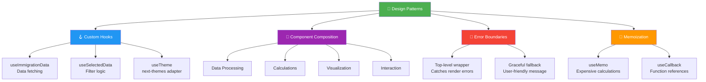
```mermaid
graph TD
    PATTERNS["🎨 Design Patterns"]
    
    PATTERNS --> HOOKS["🪝 Custom Hooks"]
    PATTERNS --> COMP["🧩 Component Composition"]
    PATTERNS --> ERROR["🚨 Error Boundaries"]
    PATTERNS --> MEMO["📌 Memoization"]
    
    HOOKS --> H1["useImmigrationData<br/>Data fetching"]
    HOOKS --> H2["useSelectedData<br/>Filter logic"]
    HOOKS --> H3["useTheme<br/>next-themes adapter"]
    
    COMP --> C1["Data Processing"]
    COMP --> C2["Calculations"]
    COMP --> C3["Visualization"]
    COMP --> C4["Interaction"]
    
    ERROR --> E1["Top-level wrapper<br/>Catches render errors"]
    ERROR --> E2["Graceful fallback<br/>User-friendly message"]
    
    MEMO --> M1["useMemo<br/>Expensive calculations"]
    MEMO --> M2["useCallback<br/>Function references"]
    
    style PATTERNS fill:#4CAF50,color:#fff
    style HOOKS fill:#2196F3,color:#fff
    style COMP fill:#9C27B0,color:#fff
    style ERROR fill:#F44336,color:#fff
    style MEMO fill:#FF9800,color:#fff
```

### Custom Hooks

**useImmigrationData** (`src/hooks/useImmigrationData.ts`) — Fetches and unpacks data
```typescript
const { data, meta, loading, error } = useImmigrationData();
```

**useSelectedData** (`src/utils/selectors.ts`) — Memoized filtering logic
```typescript
const filtered = useSelectedData(data, { scope: bureauScopeFromFilter(bureau), type });
```

**useTheme** (`src/contexts/ThemeContext.tsx`, a thin adapter over `next-themes`) — Theme management
```typescript
const { isDarkMode, toggleTheme } = useTheme();
```

### Component Composition

Charts follow a consistent pattern:

```
Raw Data
    ↓
[Filter] — Apply bureau/type filters
    ↓
[Calculate] — Chart-specific aggregations
    ↓
[Normalize] — Scale and format for visualization
    ↓
[Render] — Use Bklit UI (visx) chart components
    ↓
[Interact] — Handle tooltips and events
```

### Error Boundaries

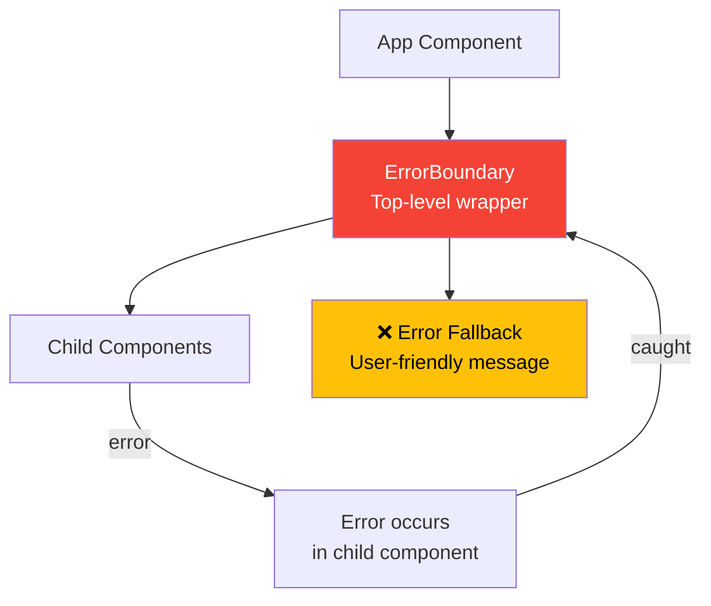
```mermaid
graph TD
    APP["App Component"]
    BOUNDARY["ErrorBoundary<br/>Top-level wrapper"]
    CHILDREN["Child Components"]
    ERROR["Error occurs<br/>in child component"]
    FALLBACK["❌ Error Fallback<br/>User-friendly message"]
    
    APP --> BOUNDARY
    BOUNDARY --> CHILDREN
    CHILDREN -->|error| ERROR
    ERROR -->|caught| BOUNDARY
    BOUNDARY --> FALLBACK
    
    style BOUNDARY fill:#F44336,color:#fff
    style FALLBACK fill:#FFC107,color:#000
```

## File Organization Philosophy

### Principle: Colocate Related Code

```
components/
├── charts/
│   ├── IntakeProcessingBarChart.tsx  # Component, styling, and its own aggregation logic
│   ├── OutcomesSankeyChart.tsx
│   └── ...
├── __tests__/
│   └── components.smoke.test.tsx     # Cross-component smoke tests
```

(Chart-specific aggregation currently lives inline in each chart component rather than in a colocated hook; utils/hooks are extracted once logic is actually shared.)

### Principle: Shared Code in Utils/Hooks

Code used by multiple components goes to:
- `src/hooks/` — Shared React hooks
- `src/utils/` — Pure utility functions
- `src/constants/` — Constants and types

### Principle: Minimal Abstraction

No unnecessary abstractions. A function isn't extracted until it's:
1. Shared by multiple components
2. Complex enough to warrant testing
3. Likely to change independently

## Key Architectural Decisions

### Decision Matrix

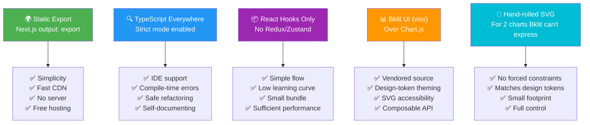
```mermaid
graph TD
    STATIC["🌍 Static Export<br/>Next.js output: export"]
    STATIC_PROS["✅ Simplicity<br/>✅ Fast CDN<br/>✅ No server<br/>✅ Free hosting"]
    
    TS["🔍 TypeScript Everywhere<br/>Strict mode enabled"]
    TS_PROS["✅ IDE support<br/>✅ Compile-time errors<br/>✅ Safe refactoring<br/>✅ Self-documenting"]
    
    STATE["📦 React Hooks Only<br/>No Redux/Zustand"]
    STATE_PROS["✅ Simple flow<br/>✅ Low learning curve<br/>✅ Small bundle<br/>✅ Sufficient performance"]
    
    CHARTS["📊 Bklit UI (visx)<br/>Over Chart.js"]
    CHARTS_PROS["✅ Vendored source<br/>✅ Design-token theming<br/>✅ SVG accessibility<br/>✅ Composable API"]
    
    CUSTOM["🎨 Hand-rolled SVG<br/>For 2 charts Bklit can't express"]
    CUSTOM_PROS["✅ No forced constraints<br/>✅ Matches design tokens<br/>✅ Small footprint<br/>✅ Full control"]
    
    STATIC --> STATIC_PROS
    TS --> TS_PROS
    STATE --> STATE_PROS
    CHARTS --> CHARTS_PROS
    CUSTOM --> CUSTOM_PROS
    
    style STATIC fill:#4CAF50,color:#fff
    style TS fill:#2196F3,color:#fff
    style STATE fill:#9C27B0,color:#fff
    style CHARTS fill:#FF9800,color:#fff
    style CUSTOM fill:#00BCD4,color:#fff
```

The Processing Efficiency and Category Mix charts don't use `visx` at all — Bklit's chart primitives couldn't express what they needed (e.g. Bklit's `ScatterChart` is time-x with a fixed 0-100 y-domain, which can't show volume-vs-rate with a size channel), so both are hand-rolled SVG instead (`d3-scale` for Processing Efficiency, no charting library at all for Category Mix).

### Why Static Export?

- **Simplicity** — No backend server needed
- **Performance** — Fast CDN delivery via GitHub Pages
- **Reliability** — No server downtime risk
- **Cost** — Free hosting on GitHub Pages

### Why TypeScript Everywhere?

- **Developer Experience** — IDE auto-complete and type hints
- **Bug Prevention** — Catch errors at compile-time
- **Refactoring Safety** — Type changes caught globally
- **Documentation** — Types serve as inline documentation

### Why No State Management Library?

- **Unnecessary Complexity** — Simple unidirectional data flow
- **Learning Curve** — Easier for new contributors
- **Bundle Size** — No Redux/Zustand overhead
- **Performance** — React's built-in state is sufficient

### Why Bklit UI (vendored) over Chart.js?

- **Design-token theming** — Every chart reads the same CSS variables as the rest of the UI, in both themes
- **Vendored source** — Components are copied into the repo (shadcn registry model), so gaps are patched locally (e.g. responsive choropleth scale, Sankey value units, the choropleth render/gesture patches below)
- **SVG rendering** — Text alternatives and styling that canvas can't offer
- **Composable API** — Charts assemble from Grid/Axis/Series/Tooltip parts, so remixes stay small

#### Local patches to the vendored choropleth

`scripts/vendor-bklit.mjs` overwrites `src/components/bklit/`, so re-vendoring drops these.
They must be reapplied — the map is unusable without them, especially on touch devices.

- **Projection above the zoom boundary** (`choropleth-chart.tsx`) — `<Zoom>` is rendered
  *below* the stable-context provider, and `featurePaths` is memoised on `[data, mercator]`.
  Upstream generates every SVG path string inside the component that re-renders on each
  pan/pinch frame, so d3-geo re-projected the whole topology per frame (~60k vertices for
  Japan). The zoom transform only ever needs to reach the wrapper `<g>`.
- **Structurally stable feature layer** (`choropleth-feature.tsx`) — one `<g>` plus an
  always-mounted highlight `<path>`, instead of upstream's branch between a `<g>` and a
  Fragment, which made React unmount and remount every feature path on hover in *and* out.
  Per-feature listeners are replaced by delegation on the parent `<g>` (`data-feature-index`).
- **Gesture handling** (`choropleth-chart.tsx`) — `zoom.containerRef` is deliberately *not*
  attached. Upstream's `useGesture` pans on a single finger, which traps page scroll on a
  full-width map. Instead: `touch-action: pan-y`, wheel/two-finger listeners bound manually
  (non-passive), mouse drag wired to `zoom.dragStart/dragMove/dragEnd`, and a delegated
  `click` so tapping a feature opens its tooltip on touch devices. On a coarse pointer that
  click goes through `onFeatureTap` (see the tap-to-pin table above) and the delegated hover
  pair is not attached at all, so a second tap dismisses rather than re-selecting.
  Pinch composes against a gesture-local matrix, because several `touchmove` events can land
  between two React renders and `zoom.transformMatrix` is a render-time snapshot.
- **Hairline borders** (`choropleth-feature.tsx`, `choropleth-graticule.tsx`) —
  `vector-effect: non-scaling-stroke` on the feature paths, the highlight path and the
  graticule. The zoom transform sits on an ancestor `<g>` and SVG scales stroke width with
  geometry, so upstream's border renders 12px wide at the Regional Map's 16× ceiling. Dividing
  the width by the live scale instead would pull the layer into the zoom context and re-render
  all 47 paths per frame, undoing the patch above.
- **Pan bound** (`choropleth-chart.tsx`) — a `constrain` prop on `<Zoom>`; upstream ships no
  translate constraint at all, so the map can be dragged clean out of the card. Note that
  supplying `constrain` *replaces* visx's scale check rather than adding to it, so it enforces
  `zoomMin`/`zoomMax` too. Two rules, binding at opposite ends of the zoom range:
  the map's bounding box must overlap the viewport by 60% per axis (stops a fling), and the
  view centre must stay within a quarter-viewport of a landmass (stops a zoomed-in view of open
  sea). The second reads an occupancy grid built once per projection from each feature's
  largest polygon, outlined and scanline-filled — bounding boxes cannot answer "is there map
  here" for an archipelago, and outlines alone leave big islands hollow.

  The bound is deliberately an overlap minimum rather than an edge lock: the Japan projection
  already leaves a gap at the top at rest, so "content must cover the viewport" would snap the
  map on the first drag.

## Testing Strategy

### Unit Tests for Logic

```typescript
// Test pure functions (src/utils/__tests__/calculateEstimates.test.ts)
describe('calculateEstimatedDate month-boundary sensitivity', () => {
  it('documents that the estimate can jump sharply the moment a new month is first published', () => {
    // Simulate "today" landing right before vs. right after a slow month's
    // figures are first published, and confirm the estimate legitimately
    // shifts once real (slower) throughput is known.
    const before = calculateEstimatedDate(dataThroughJune, { bureau: 'Osaka', type: 'X', applicationDate: '2025-07-30' });
    const after = calculateEstimatedDate(dataThroughJuly, { bureau: 'Osaka', type: 'X', applicationDate: '2025-07-31' });
    expect(before?.details.dataQuality).toBe('low');
    expect(after?.details.dataQuality).toBe('high');
  });
});
```

### Integration Tests for Components

```typescript
// Test component behavior (src/components/__tests__/components.smoke.test.tsx)
test('StatCard renders title, formatted value, and MoM delta', () => {
  render(<StatCard title="Total Applications" value={12345} delta={{ percent: 3.2, direction: 'neutral' }} {...rest} />);
  expect(screen.getByText('Total Applications')).toBeTruthy();
});
```

### No E2E Tests Currently

**Reason:** Difficult to test in CI without real data, and most logic is unit-testable.

## Security & Dependency Management

### Dependency Pinning Strategy

**Some critical dependencies are pinned to exact versions:**

- **Next.js ecosystem:** `next`, `@next/third-parties`, `@next/eslint-plugin-next`, `eslint-config-next`
- **Type safety (linting):** `@typescript-eslint/eslint-plugin`, `@typescript-eslint/parser`
- **Code quality:** `eslint`

`react`, `react-dom`, and `typescript` currently use `^` caret ranges rather than exact pins.

**Benefits:**
- **Reproducibility** — Same versions across all environments (local + CI/CD)
- **Stability** — No unexpected minor/patch updates breaking functionality
- **Security** — Controlled updates for security-critical packages
- **Consistency** — Team and CI work with identical dependency versions

**Non-critical dependencies** use caret ranges (`^`) to allow patch updates automatically.

### Security Audits

There is currently no automated `npm audit` step in CI (`.github/workflows/verify.yaml` runs lint, typecheck, test, and a fixture build; `deploy.yaml` verifies, builds and deploys). Audits are a manual, pre-merge step:

```bash
npm audit --audit-level=moderate
```

**Response Protocol:**
1. Developer runs `npm audit` locally to identify vulnerabilities
2. Address with `npm audit fix` or manual package updates
3. Test thoroughly before merging
4. Document security fixes in commit messages and CHANGELOG

### Handling Vulnerabilities

**Transitive Dependencies:** Some vulnerabilities may be in packages that dependencies depend on:

```bash
npm audit --json | jq '.vulnerabilities'  # See all issues
npm ls vulnerable-package                  # See where it's required
npm audit fix                              # Auto-fix if available
npm install parent-package@latest          # Update parent if needed
```

**Known Vulnerabilities:** If a vulnerability exists but no fix is available yet:
1. Document in a code comment with the CVE number
2. Track in GitHub issues
3. Monitor for updates
4. Use `npm audit --force` only as a temporary measure with justification

## Future Architecture Improvements

1. **Testing** — Increase test coverage for edge cases
2. **Performance** — Monitor Core Web Vitals, optimize if needed
3. **Accessibility** — More ARIA labels and keyboard navigation
4. **Documentation** — Inline code comments for complex logic
5. **Caching** — Service Worker for offline support
6. **Dependencies** — Automated dependency update checks (Dependabot)

## Glossary

- **Bureau** — Regional Immigration Bureau (e.g., Shinagawa, Osaka)
- **Status** — Application processing status (e.g., "Processing", "Approved")
- **Aggregate Bureau** — Bureau with branch offices (data includes branches)
- **Branch Office** — Sub-bureau reporting separately (e.g., Yokohama under Shinagawa)
- **e-Stat** — Official Japanese statistics API
- **SURVEY_DATE** — Date of data collection in e-Stat

---

For questions about specific components or design decisions, check the code comments or open a [GitHub discussion](https://github.com/RetroHazard/JP_Immigration_Dashboard/discussions).
